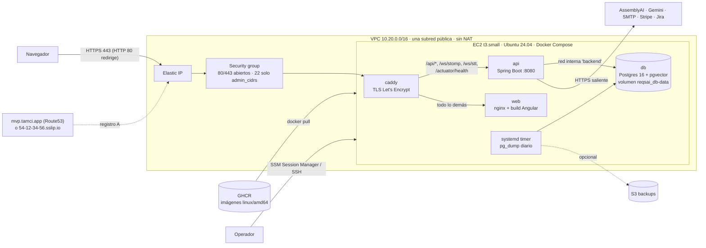
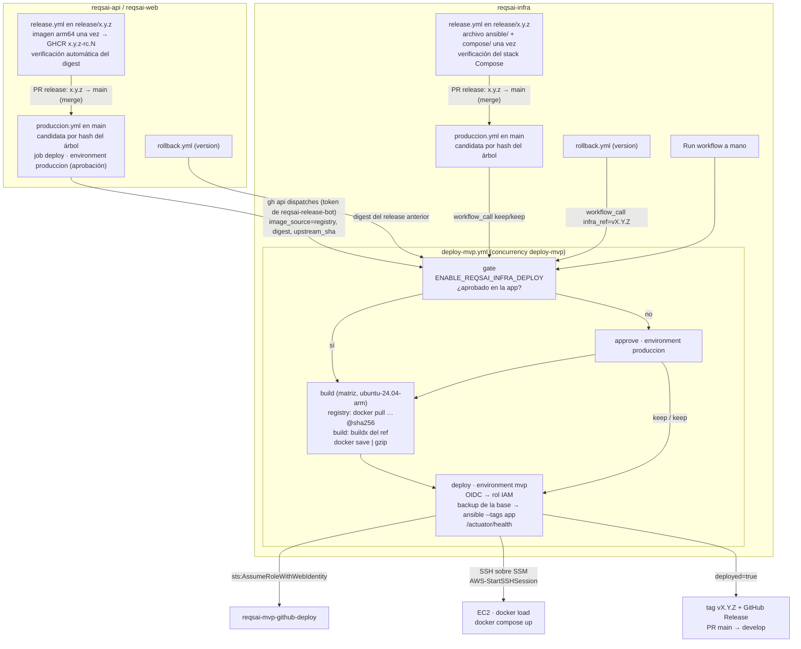

# Despliegue económico de ReqsAI en una sola EC2 con Docker Compose

Esta guía describe el entorno `envs/ec2-compose`: **toda la aplicación (Postgres + pgvector, API Spring Boot,
frontend Angular y un proxy HTTPS) en una única instancia EC2**, aprovisionada con Terraform y configurada con
Ansible. Es la opción más barata que sigue funcionando bien para un MVP, demos o un piloto con pocos usuarios.

> **Resumen:** ~**US$ 21/mes** con `t3.small` (≈ US$ 14/mes con `t3.micro`) frente a ~**US$ 115/mes** del stack
> actual ECS Fargate + ALB + NAT + RDS + CloudFront. A cambio se acepta un único punto de falla, escalado solo
> vertical y unos minutos de corte en cada despliegue.

Nada de esto toca `bootstrap/` ni `envs/production/`: el entorno tiene su propio estado
(`envs/ec2-compose/terraform.tfstate` en el mismo bucket S3) y solo **lee** la zona Route53 `tamci.app` para crear
un registro `A`.

---

## Índice

1. [Arquitectura](#1-arquitectura)
2. [Decisiones de diseño](#2-decisiones-de-diseño)
3. [Costos: por qué es más barato](#3-costos-por-qué-es-más-barato)
4. [Capa gratuita de AWS (Free Tier)](#4-capa-gratuita-de-aws-free-tier)
5. [Prerrequisitos](#5-prerrequisitos)
6. [Paso a paso](#6-paso-a-paso)
7. [Actualizar y volver a desplegar](#7-actualizar-y-volver-a-desplegar)
8. [Operación diaria](#8-operación-diaria)
9. [Backups y restauración](#9-backups-y-restauración)
10. [Teardown (eliminar el entorno)](#10-teardown-eliminar-el-entorno)
11. [Limitaciones y cuándo volver al stack ECS](#11-limitaciones-y-cuándo-volver-al-stack-ecs)
12. [Solución de problemas](#12-solución-de-problemas)
13. [Referencia de archivos y variables](#13-referencia-de-archivos-y-variables)
14. [Despliegue continuo con GitHub Actions](#14-despliegue-continuo-con-github-actions)
15. [Fuentes](#15-fuentes)

---

## 1. Arquitectura



Contenedores (`compose/compose.yaml`):

| Servicio | Imagen | Red | Expuesto | Función |
| --- | --- | --- | --- | --- |
| `caddy` | `caddy:2.11-alpine` | `edge` | 80/tcp, 443/tcp, 443/udp | TLS automático, enrutamiento, WebSockets |
| `web` | `ghcr.io/kntro-soft/reqsai-web:<tag>` | `edge` | no | nginx sirviendo el build de Angular (SPA) |
| `api` | `ghcr.io/kntro-soft/reqsai-api:<tag>` | `edge` + `backend` | no | Spring Boot (`SPRING_PROFILES_ACTIVE=prod`) |
| `db` | `pgvector/pgvector:0.8.7-pg16` | `backend` (interna) | no | Postgres 16 + pgvector, volumen persistente |

La red `backend` es `internal: true`: Postgres no tiene salida a internet ni puertos publicados, ni siquiera en
el host. Solo `api` llega a él.

Enrutamiento de Caddy (`compose/caddy/Caddyfile`):

| Ruta | Destino | Uso |
| --- | --- | --- |
| `/api/*` | `api:8080` | REST (incluye `/api/billing/webhooks/stripe`) |
| `/ws/*` | `api:8080` | STOMP sobre WebSocket (`/ws/stomp`) y audio binario para STT (`/ws/stt`) |
| `/actuator/health`, `/actuator/health/*` | `api:8080` | health checks públicos |
| `/api-docs*`, `/swagger-ui*` | `api:8080` | solo si se habilita springdoc |
| todo lo demás | `web:80` | Angular; nginx ya hace el fallback a `index.html` |

Caddy soporta WebSockets sin configuración extra y no impone timeouts de lectura en conexiones largas. El frontend
usa rutas relativas (`apiUrl: ''`, `wsUrl: ''`), así que todo funciona bajo el mismo origen, igual que con
CloudFront en producción.

---

## 2. Decisiones de diseño

### HTTPS obligatorio, con Caddy y Let's Encrypt

Los navegadores solo exponen `navigator.mediaDevices.getUserMedia` (micrófono), `getDisplayMedia` (captura de
pantalla/pestaña con audio) y `AudioWorklet` en **contextos seguros** (HTTPS o `localhost`). Sin HTTPS la
grabación de reuniones no funciona. Caddy obtiene y renueva el certificado solo, mediante los retos HTTP-01 /
TLS-ALPN-01, por eso los puertos 80 y 443 están abiertos a internet.

Dos modos, elegidos con variables de Terraform:

| Modo | Variables | Hostname resultante | Cuándo usarlo |
| --- | --- | --- | --- |
| **Subdominio Route53** | `dns_zone_name = "tamci.app"`, `dns_record_name = "mvp"` | `mvp.tamci.app` | Recomendado. Solo se crea un registro `A` en la zona existente. |
| **Sin dominio (sslip.io)** | `dns_zone_name = ""` | `54-12-34-56.sslip.io` | Pruebas rápidas o cuentas sin zona. sslip.io resuelve el nombre a la IP embebida; Let's Encrypt emite certificados para esos nombres. |

La zona `tamci.app` la administra `envs/production` (allí está `aws_route53_zone.root`). Este entorno solo la
consulta con un `data` source y crea `aws_route53_record.app`; no puede modificar `app.tamci.app` ni
`api.tamci.app`. Si el nombre ya existe, `terraform apply` falla en lugar de sobrescribirlo.

> **Estado real del DNS (verificado el 7 de octubre de 2026).** `tamci.app` y `tamci.software` resuelven con los
> nameservers de name.com, no con Route53. La zona de `tamci.app` ya no existe en la cuenta, y la zona
> `tamci.software` que sí existe en Route53 no es autoritativa, así que un registro creado ahí no se resuelve en
> internet. Mientras la delegación siga en name.com hay dos opciones sin costo: usar sslip.io
> (`dns_zone_name = ""`), o crear a mano en name.com un registro `A` (por ejemplo, `mvp.tamci.app`) que apunte a
> la Elastic IP y luego pasar ese nombre a Ansible con `-e app_hostname=mvp.tamci.app` (o editarlo en el inventario
> generado por `make inventory`). La zona `tamci.software` de Route53 cuesta
> US$ 0.50 al mes sin uso; se puede borrar si no se piensa delegar el dominio a AWS.

**Permissions-Policy:** la imagen `reqsai-web` trae en su `nginx.conf` la cabecera
`Permissions-Policy: camera=(), microphone=(), geolocation=()`, que **bloquea el micrófono**. En producción no
afecta porque CloudFront sirve el build desde S3 sin nginx. En este entorno Caddy reescribe esa cabecera a
`camera=(), microphone=(self), display-capture=(self), geolocation=()`, y Ansible verifica tras cada despliegue
que la cabecera publicada contenga `microphone=(self)`.

### Instancia: x86 `t3.small` por defecto

- **`t3.small` (2 vCPU, 2 GiB)** es el valor por defecto: Spring Boot + Hibernate + Spring AI + Postgres caben
  con margen y swap como colchón.
- **`t3.micro` (1 GiB)** funciona como opción gratuita/mínima (perfil de memoria `micro`, swap de 4 GiB), pero
  arranca lento y usará swap bajo carga.
- **`t4g.small` (Graviton)** es más barato por hora, pero exige imágenes `linux/arm64` o multi-arch
  (`PLATFORM=linux/amd64,linux/arm64 make images`). Terraform detecta la arquitectura del tipo de instancia y
  elige la AMI correcta; el output `instance_architecture` indica para qué plataforma construir.
- **Créditos de CPU `standard`** (variable `cpu_credits`): nunca se cobran créditos excedentes. Las T3 no
  reciben créditos de lanzamiento, así que el **primer arranque** corre a la línea base (20 % por vCPU en
  `t3.small`) y tarda algunos minutos; después la instancia acumula créditos mientras está ociosa. Con
  `cpu_credits = "unlimited"` no hay estrangulamiento, pero si el promedio de 24 h supera la línea base se paga
  el excedente (US$ 0.05 por vCPU-hora en Linux).

Ubuntu 24.04 LTS (AMI oficial de Canonical, con el agente SSM preinstalado). El volumen raíz es gp3 cifrado
(30 GiB por defecto), IMDSv2 obligatorio con `http_put_response_hop_limit = 1` (los contenedores no pueden leer
las credenciales del rol de la instancia) y protección contra terminación activada por defecto porque la base de
datos vive en ese disco.

### Presupuesto de memoria

Los límites viven en `ansible/group_vars/reqsai/memory.yml` y Terraform elige el perfil según la RAM del tipo
de instancia (`small` con ≥ 2 GiB, `micro` en otro caso).

| Componente | Perfil `small` (t3.small) | Perfil `micro` (t3.micro) |
| --- | --- | --- |
| Swap (`/swapfile`, `vm.swappiness=10`) | 2 GiB | 4 GiB |
| API: `mem_limit` | 1024 MiB | 768 MiB |
| API: JVM | `-Xms256m -Xmx512m`, metaspace ≤ 256 MiB, SerialGC | `-Xms128m -Xmx384m`, metaspace ≤ 224 MiB, SerialGC, `TieredStopAtLevel=1` |
| API: pool Hikari (`DB_POOL_SIZE`) | 10 | 6 |
| Postgres: `mem_limit` | 512 MiB | 256 MiB |
| Postgres: `shared_buffers` / `effective_cache_size` | 128 MB / 512 MB | 64 MB / 256 MB |
| Postgres: `work_mem` / `maintenance_work_mem` | 4 MB / 64 MB | 2 MB / 32 MB |
| Postgres: `max_connections` | 40 | 25 |
| web (nginx) / caddy | 64 MiB / 128 MiB | 48 MiB / 96 MiB |

Consumo medido en la prueba local del stack completo (imágenes arm64 recién construidas, sin tráfico, tras el
arranque): perfil `small` → API ~685 MiB, Postgres ~40 MiB, Caddy ~20 MiB, nginx ~13 MiB; perfil `micro` →
API ~590 MiB. Con carga real el heap crece hasta el `-Xmx`, por eso el límite del contenedor deja ~300–500 MiB
para metaspace, code cache e hilos.

La API arranca con `-XX:+ExitOnOutOfMemoryError`: si se queda sin heap, el contenedor muere y Docker lo
reinicia (`restart: unless-stopped`) en vez de quedar en un estado degradado. Las imágenes **no se compilan en la
instancia**: compilar Gradle o Angular con 1–2 GiB de RAM provoca OOM o tarda decenas de minutos.

### Registro de imágenes: GHCR

| Opción | Costo | Ventajas | Desventajas |
| --- | --- | --- | --- |
| **GHCR (elegido)** | Hoy gratis: GitHub indica que el almacenamiento y el ancho de banda del Container registry son gratuitos por ahora y avisará con un mes de antelación si cambia | Independiente de AWS (sobrevive a un `destroy` del stack de producción), vive junto al código | El host necesita un token de GitHub (`read:packages`) en el vault |
| ECR | US$ 0.10 por GB-mes; el pull desde EC2 en la misma región no paga transferencia | Sin credenciales estáticas (rol IAM), CI ya publica la API en `reqsai-api` | El repo `reqsai-api` pertenece a `envs/production` (se borraría con ese stack) y no existe imagen del frontend en ECR |

Con las dos imágenes (~0.3 GB en total por versión) ambas opciones cuestan centavos; GHCR gana por no acoplar este
entorno al stack que pretende reemplazar. ECR queda soportado: `enable_ecr_pull = true` en Terraform y
`app_registry_auth: ecr` en Ansible (instala `amazon-ecr-credential-helper`, sin `docker login`).

### Secretos: ansible-vault

| Opción | Costo | Notas |
| --- | --- | --- |
| **ansible-vault (elegido)** | US$ 0 | Los secretos se cifran localmente (AES-256) y Ansible los descifra solo al renderizar `/opt/reqsai/.env` y `/opt/reqsai/api.env` (modo `0600`, dueño `root`). Sin llamadas a AWS ni permisos IAM extra. |
| SSM Parameter Store (SecureString, nivel estándar) | Prácticamente gratis | Requiere permisos IAM y lookups `amazon.aws` desde la máquina del operador; más piezas móviles para el mismo resultado. |
| Secrets Manager | US$ 0.40 por secreto-mes | Es lo que usa ECS; aquí no aporta (no hay inyección nativa en Compose). |

`ansible/group_vars/reqsai/vault.yml` está en `.gitignore` aunque esté cifrado; guarda la contraseña del vault en
el gestor de contraseñas del equipo. Ningún valor real se escribe en Terraform, en el estado ni en el repositorio.

### Red y acceso

- VPC propia mínima (una subred pública, internet gateway, sin NAT). No depende de la VPC por defecto y no
  comparte nada con la VPC de producción.
- Security group: 80/443 TCP y 443 UDP (HTTP/3) desde cualquier lugar; **22 cerrado por defecto**.
- Acceso de administración por **SSM Session Manager** (rol con `AmazonSSMManagedInstanceCore`). Ansible usa SSH
  *tunelizado por SSM* (`AWS-StartSSHSession`), de modo que no hace falta abrir el puerto 22. Si prefieres SSH
  directo, define `admin_cidrs = ["<tu-ip>/32"]` y el inventario generado apuntará a la IP pública.

---

## 3. Costos: por qué es más barato

Precios on-demand en **us-east-1**, verificados el **7 de octubre de 2026** contra los archivos públicos de la
AWS Price List (los mismos datos que muestran las páginas de precios; publicación EC2 del 25-09-2026). Se usan
730 horas por mes. No incluyen impuestos ni el costo de AssemblyAI/Gemini/SMTP, que es igual en ambos stacks.

**Stack actual (`envs/production`)**, con tráfico bajo:

| Recurso | Cálculo | US$/mes |
| --- | --- | --- |
| ECS Fargate, 1 tarea 1 vCPU / 2 GB 24×7 | (0.04048 + 2 × 0.004445) × 730 | 36.04 |
| NAT Gateway (1) | 0.045 × 730 (+ 0.045 por GB procesado) | 32.85 |
| Application Load Balancer | 0.0225 × 730 (+ LCU a 0.008/LCU-h) | 16.43 + LCU |
| RDS PostgreSQL `db.t4g.micro` Single-AZ | 0.016 × 730 | 11.68 |
| RDS gp3 20 GB | 20 × 0.115 | 2.30 |
| IPv4 públicas (≥ 2 del ALB + 1 del NAT) | 3 × 0.005 × 730 | 10.95 |
| Secrets Manager (5 secretos + el de RDS) | 6 × 0.40 | 2.40 |
| CloudFront | dentro de la capa siempre gratuita (1 TB/mes) | ~0 |
| Route53 zona `tamci.app` | 0.50 | 0.50 |
| CloudWatch Logs, ECR, consultas DNS | estimado | ~1 |
| **Total aproximado** | | **≈ 115–120** |

**Este entorno (`envs/ec2-compose`)**:

| Recurso | `t3.small` (por defecto) | `t3.micro` | `t4g.small` (requiere arm64) |
| --- | --- | --- | --- |
| EC2 on-demand | 0.0208 × 730 = 15.18 | 0.0104 × 730 = 7.59 | 0.0168 × 730 = 12.26 |
| EBS gp3 30 GB (0.08 GB-mes) | 2.40 | 2.40 | 2.40 |
| IPv4 pública (Elastic IP asociada, 0.005/h) | 3.65 | 3.65 | 3.65 |
| Route53 (la zona ya se paga; consultas 0.40 por millón) | ~0 | ~0 | ~0 |
| S3 para backups (opcional, 0.023 GB-mes) | < 0.05 | < 0.05 | < 0.05 |
| Transferencia de salida | primeros 100 GB/mes gratis (agregados entre regiones), luego 0.09/GB | igual | igual |
| **Total aproximado** | **≈ 21.2** | **≈ 13.6** | **≈ 18.3** |

Lo que se elimina: el NAT Gateway (el ítem más caro después de Fargate y que existe solo para dar salida a
subredes privadas), el ALB, RDS, las IP públicas adicionales y los secretos de Secrets Manager. Postgres y el
frontend pasan a la misma máquina que la API.

---

## 4. Capa gratuita de AWS (Free Tier)

Las reglas cambiaron el **15 de julio de 2025** y dependen de la fecha de creación de la cuenta:

| | Cuentas creadas **antes** del 15-07-2025 (Free Tier "legacy") | Cuentas creadas **desde** el 15-07-2025 |
| --- | --- | --- |
| Modelo | 12 meses de cuotas mensuales; lo que exceda se paga a tarifa normal | US$ 100 de crédito al registrarse + hasta US$ 100 más por completar actividades |
| Duración | 12 meses desde la creación de la cuenta | Plan **Free**: 6 meses o hasta agotar créditos (lo que ocurra primero); al terminar la cuenta se suspende y hay 90 días para pasar a plan **Paid**. Plan **Paid**: los créditos se aplican y luego se paga por uso |
| Instancias elegibles | `t2.micro` y `t3.micro` (750 h/mes de Linux entre todas las regiones; la FAQ legacy indica `t3.micro` en las regiones sin `t2.micro`) | `t3.micro`, `t3.small`, `t4g.micro`, `t4g.small`, `c7i-flex.large`, `m7i-flex.large` (el uso consume créditos) |
| EBS | 30 GB (gp2/gp3/…) | consume créditos |
| IPv4 pública | 750 h/mes en EC2 durante los 12 meses | consume créditos |

Implicaciones:

- **Cuenta legacy dentro de sus 12 meses:** usa `instance_type = "t3.micro"` (o `t2.micro`) y
  `root_volume_size = 30`; cómputo, disco e IPv4 quedan cubiertos. Confirma qué tipos son elegibles en tu cuenta
  con `aws ec2 describe-instance-types --filters Name=free-tier-eligible,Values=true --query "InstanceTypes[].InstanceType"`
  o con el output `instance_free_tier_eligible` tras el `apply`.
- **Cuenta nueva:** `t3.small` es elegible y sus ~US$ 21/mes se descuentan del crédito (≈ 9 meses con US$ 200,
  pero el plan Free termina a los 6 meses de todos modos).
- **Cuenta fuera de la capa gratuita:** aplica la tabla de costos de la sección 3.
- La transferencia de salida (100 GB/mes) y CloudFront (1 TB/mes) son gratuitos para todas las cuentas.
- No se pudo verificar la fecha de creación de la cuenta `418272789689`; revísala en *Billing → Free Tier*.

---

## 5. Prerrequisitos

En la máquina del operador:

- Terraform **≥ 1.10** (el backend S3 usa `use_lockfile`).
- AWS CLI v2 con credenciales de la cuenta y el **Session Manager plugin**
  (`brew install --cask session-manager-plugin`).
- Ansible core **≥ 2.15** y las colecciones de `ansible/requirements.yml` (`make galaxy`).
- Docker con `buildx` para construir las imágenes.
- Un par de llaves SSH (`~/.ssh/id_ed25519.pub` por defecto).
- Un **PAT clásico de GitHub** con `write:packages` para publicar imágenes y otro (o el mismo usuario de
  servicio) con solo `read:packages` para que el host las descargue.
- Credenciales de la app: llaves JWT, `INTEGRATIONS_ENCRYPTION_KEY` (obligatoria: la API no arranca sin ella),
  API keys de AssemblyAI y Gemini, cuenta SMTP (Gmail con App Password) y, si aplica, Stripe y Jira.
- Un correo para Let's Encrypt (`app_acme_email`).

---

## 6. Paso a paso

Todos los comandos se ejecutan desde la raíz de `reqsai-infra`.

### 6.1 Construir y publicar las imágenes

```bash
echo "$GHCR_TOKEN" | docker login ghcr.io -u <usuario-github> --password-stdin
make images
```

`scripts/build-and-push-images.sh` construye `reqsai-api` y `reqsai-web` desde los repos hermanos
(`../ReqsAI/reqsai-api` y `../ReqsAI/reqsai-web` por defecto) para `linux/amd64` y publica dos tags:
el SHA corto del commit (con sufijo `-dirty` si hay cambios sin commitear) y `latest`. También añade la etiqueta
`org.opencontainers.image.source`, con la que GHCR vincula el paquete al repositorio y hereda sus permisos.

Variables útiles: `API_SRC`, `WEB_SRC`, `REGISTRY` (por defecto `ghcr.io/kntro-soft`), `TAG`, `TARGETS="api"`,
`PLATFORM=linux/amd64,linux/arm64` (multi-arch para Graviton) y `PUSH=0` (cargar en Docker local sin publicar).

En Mac con Apple Silicon la imagen `amd64` se compila bajo emulación QEMU: la API puede tardar 10–20 minutos.
A futuro conviene que el CI de cada repo publique en GHCR en cada merge.

### 6.2 Crear la infraestructura con Terraform

```bash
cd envs/ec2-compose
cp terraform.tfvars.example terraform.tfvars
$EDITOR terraform.tfvars
terraform init
terraform plan
terraform apply
cd ../..
```

En `terraform.tfvars` decide el modo de hostname (`dns_zone_name = "tamci.app"` o `""` para sslip.io), el tipo
de instancia y si quieres el bucket de backups (`enable_backup_bucket = true`). Outputs relevantes:

| Output | Uso |
| --- | --- |
| `app_url` | URL pública final |
| `public_ip`, `instance_id` | Elastic IP y destino de SSM |
| `ssh_command`, `ssm_session_command` | Acceso a una shell |
| `memory_profile`, `instance_architecture`, `instance_free_tier_eligible` | Diagnóstico |
| `ansible_inventory` | Inventario listo para Ansible |

### 6.3 Generar el inventario

```bash
make inventory
```

Escribe `ansible/inventory/hosts.yml` (ignorado por git) a partir del output `ansible_inventory`: host, usuario,
hostname público, región, perfil de memoria, bucket de backups y, si el puerto 22 está cerrado, el `ProxyCommand`
de SSM.

### 6.4 Preparar los secretos (ansible-vault)

```bash
cp ansible/group_vars/reqsai/vault.yml.example ansible/group_vars/reqsai/vault.yml

openssl genpkey -algorithm RSA -pkeyopt rsa_keygen_bits:2048 -out jwt_private.pem
openssl rsa -pubout -in jwt_private.pem -out jwt_public.pem
openssl rand -base64 32
openssl rand -hex 32
openssl rand -base64 33 | tr -d '/+='

$EDITOR ansible/group_vars/reqsai/vault.yml
ansible-vault encrypt ansible/group_vars/reqsai/vault.yml
rm jwt_private.pem jwt_public.pem
```

Qué va en cada clave del vault:

| Clave | Valor |
| --- | --- |
| `vault_postgres_password` | contraseña de Postgres, ≥ 16 caracteres (última línea de los `openssl` anteriores) |
| `vault_registry_password` | PAT de GitHub con `read:packages` |
| `vault_jwt_private_key_pem` / `vault_jwt_public_key_pem` | contenido de `jwt_private.pem` (PKCS#8, `BEGIN PRIVATE KEY`) y `jwt_public.pem`, como bloque YAML `\|` |
| `vault_integrations_encryption_key` | salida de `openssl rand -base64 32` |
| `vault_jira_oauth_state_secret` | salida de `openssl rand -hex 32` (solo si se usa Jira) |
| `vault_assemblyai_api_key`, `vault_gemini_api_key` | llaves de STT y de generación/embeddings |
| `vault_deepgram_api_key`, `vault_openai_api_key` | solo si se cambian los proveedores (ver abajo) |
| `vault_mail_username`, `vault_mail_password` | SMTP (Gmail + App Password); `MAIL_FROM` toma el usuario salvo que definas `app_mail_from` |
| `vault_stripe_*`, `vault_jira_oauth_client_*` | opcionales |
| `vault_git_token` | solo para la compilación en el host (sección 7.3) |

Ningún valor puede contener comillas simples ni saltos de línea (los PEM se aplanan automáticamente); Ansible lo
valida antes de escribir los archivos.

> Si este entorno va a reutilizar datos de producción, usa las **mismas** llaves JWT e
> `INTEGRATIONS_ENCRYPTION_KEY` que hay en Secrets Manager (`reqsai/production/jwt` y `reqsai/production/jira`);
> con llaves nuevas, los secretos de integraciones cifrados en la base no se podrán descifrar.

### 6.5 Ajustar las variables no secretas

Edita `ansible/group_vars/reqsai/vars.yml`:

- `app_acme_email`: correo para Let's Encrypt (obligatorio).
- `app_registry_username`: usuario de GitHub dueño del PAT de lectura (`app_registry_auth: none` si los paquetes
  son públicos, `ecr` para ECR).
- `app_api_image` / `app_web_image`: `:latest` o, mejor, el tag con SHA publicado en 6.1.
- `app_api_settings`: proveedores y opciones no secretas de la API. Por defecto coinciden con
  `application-prod.yml` (AssemblyAI para STT batch/streaming, Gemini para generación y embeddings, billing
  `fake`). Para replicar lo que hoy corre en ECS (Deepgram + OpenAI), cambia `STT_PROVIDER`,
  `STT_STREAMING_PROVIDER`, `GENERATION_PROVIDER`, `EMBEDDING_PROVIDER`, `SPRING_AI_MODEL_CHAT` y
  `SPRING_AI_MODEL_EMBEDDING` a `deepgram`/`openai` y llena las llaves correspondientes del vault. Para cobros
  reales: `BILLING_PAYMENT_PROVIDER: stripe`, los `*_STRIPE_PRICE_ID` y el webhook en
  `https://<host>/api/billing/webhooks/stripe`.

La API recibe además, calculados por Ansible: `APP_URL`, `FRONTEND_URL`, `WEB_APP_URL` y
`CORS_ALLOWED_ORIGINS` (= `https://<host>`, que también alimenta los orígenes permitidos de WebSocket),
`DB_*`, `SPRING_PROFILES_ACTIVE=prod` y `SERVER_FORWARD_HEADERS_STRATEGY=native` (para que Spring respete
`X-Forwarded-Proto` de Caddy).

### 6.6 Ejecutar Ansible

```bash
make galaxy
make deploy
```

`make deploy` ejecuta `ansible/site.yml` (pide la contraseña del vault; usa
`make deploy VAULT_ARGS="--vault-password-file ~/.reqsai-vault-pass"` para leerla de un archivo `0600`).
Los roles, en orden:

1. **base**: paquetes, actualizaciones de seguridad automáticas, límite del journal, swap y `sysctl`.
2. **docker**: Docker Engine + Compose plugin desde el repositorio oficial y rotación de logs.
3. **app**: valida variables, copia `compose.yaml` y el `Caddyfile` a `/opt/reqsai`, renderiza `.env` y
   `api.env` (`0600`), hace login en el registro, `docker compose up` con `pull: always` y espera a que los
   health checks pasen. Al final comprueba `https://<host>/actuator/health/readiness` y la cabecera
   `Permissions-Policy` del frontend.
4. **backup**: scripts `reqsai-backup` / `reqsai-restore` y el timer diario.

El primer despliegue tarda ~10–15 minutos (instalación de Docker, descarga de imágenes, emisión del certificado y
primer arranque de Spring Boot con migraciones Flyway, sin créditos de CPU acumulados).

### 6.7 Primer acceso

1. Abre `terraform -chdir=envs/ec2-compose output -raw app_url`.
2. Comprueba el candado (certificado de Let's Encrypt) y `https://<host>/actuator/health` → `{"status":"UP"}`.
3. Regístrate. La verificación de correo requiere SMTP configurado.
4. Inicia una sesión de descubrimiento y concede el permiso de micrófono: el navegador debe pedirlo (si no lo
   pide, revisa la sección 12).

---

## 7. Actualizar y volver a desplegar

### 7.1 Nueva versión de la aplicación

```bash
make images
$EDITOR ansible/group_vars/reqsai/vars.yml
make redeploy
```

`make redeploy` ejecuta solo el rol `app` (`--tags app`): vuelve a renderizar la configuración, descarga las
imágenes y recrea únicamente los contenedores cuya imagen o configuración cambió. Si usas `:latest` no hace
falta editar `vars.yml`; con tags SHA, actualiza `app_api_image`/`app_web_image`.

**Hay corte**: mientras la API reinicia (1–3 min en `t3.small`), Caddy responde 502 en `/api/*` y las
sesiones WebSocket activas se cortan. Despliega fuera del horario de uso.

**Rollback:** vuelve a poner el tag anterior en `vars.yml` y ejecuta `make redeploy`. Por eso se recomiendan tags
SHA en lugar de `latest`.

### 7.2 Cambios de configuración

- Secretos: `ansible-vault edit ansible/group_vars/reqsai/vault.yml` y `make redeploy`.
- Caddyfile: edita `compose/caddy/Caddyfile` y `make redeploy` (Caddy se recarga sin reiniciar).
- Tipo de instancia: cambia `instance_type` en `terraform.tfvars`, `terraform apply` (la instancia se detiene y
  arranca; conserva la Elastic IP y el disco) y luego `make inventory && make deploy` para aplicar el nuevo
  perfil de memoria y swap.

### 7.3 Alternativa: compilar en el host (más lento)

Con `app_build_on_host: true` Ansible clona `app_api_git_repo` / `app_web_git_repo` (con `vault_git_token` si
son privados), **detiene la API** para liberar memoria y ejecuta `docker build` en la instancia, etiquetando
`reqsai-api:local` y `reqsai-web:local`. En `t3.small` con swap tarda del orden de 20–40 minutos y el corte dura
todo ese tiempo; en `t3.micro` no se recomienda. Úsalo solo si no hay forma de publicar imágenes.

### 7.4 Alternativa: imágenes como archivos, sin registry (costo cero)

Sin GHCR ni ECR: las imágenes se construyen en la laptop y Ansible las sube a la instancia como archivos
comprimidos. Conviene con una instancia Graviton (`t4g.*`) si la laptop es Apple Silicon, porque se compila
para `linux/arm64` de forma nativa, sin emulación.

```bash
API_SRC=../ReqsAI/reqsai-api WEB_SRC=../ReqsAI/reqsai-web PLATFORM=linux/arm64 make images-archive
cd ansible && ansible-playbook site.yml --ask-vault-pass -e app_images_archive_dir=$PWD/../dist/images
```

`make images-archive` deja `dist/images/reqsai-api.tar.gz` y `dist/images/reqsai-web.tar.gz` (ignorados por
Git). Con `app_images_archive_dir` definido, Ansible omite el login al registry, copia los archivos a
`/opt/reqsai/images`, ejecuta `docker load` solo si cambiaron y levanta Compose con `reqsai-api:archive` y
`reqsai-web:archive`. El `PLATFORM` debe coincidir con la salida `instance_architecture` de Terraform.

Si el directorio trae solo uno de los dos archivos, Ansible sube ese y conserva la imagen que ya estaba cargada
para la otra app; si alguna de las dos imágenes no existe en el host, el rol falla antes de tocar Compose.

Este mismo flujo es el que automatiza GitHub Actions: ver la
[sección 14](#14-despliegue-continuo-con-github-actions).

---

## 8. Operación diaria

```bash
aws ssm start-session --region us-east-1 --target <instance_id>
sudo -i
cd /opt/reqsai
docker compose ps
docker compose logs -f --tail=200 api
docker stats --no-stream
docker compose restart api
docker compose exec db psql -U reqsai -d reqsai
```

- Los logs de los contenedores rotan a 3 × 10 MB por servicio; no se envían a CloudWatch.
- Caddy no registra accesos (su comportamiento por defecto). Es intencional: el token JWT viaja en la query de
  `/ws/stt` y no debe terminar en logs.
- Ubuntu aplica parches de seguridad automáticamente; los reinicios del kernel son manuales
  (`sudo reboot` en una ventana de mantenimiento; todo vuelve a levantar solo).
- Para inspeccionar el certificado: `docker compose logs caddy | grep -i certificate`.

---

## 9. Backups y restauración

**Qué se respalda:** la base completa (`pg_dump --format=custom`, incluye los esquemas de todos los tenants y
la extensión `vector`) en `/var/backups/reqsai/reqsai-<fecha>.dump`, todos los días a las 03:30 UTC (± 15 min).
Se conservan los 7 más recientes (`backup_keep`). Si `enable_backup_bucket = true`, cada dump también se sube a
`s3://reqsai-mvp-db-backups-<cuenta>/postgres/`, donde expira a los 30 días (`backup_bucket_retention_days`).

```bash
systemctl list-timers reqsai-backup.timer
sudo /usr/local/sbin/reqsai-backup
journalctl -u reqsai-backup --since today
make backup-now
```

Copiar un backup a tu máquina:

```bash
scp -o ProxyCommand="aws ssm start-session --region us-east-1 --target %h --document-name AWS-StartSSHSession --parameters portNumber=%p" \
  ubuntu@<instance_id>:/var/backups/reqsai/reqsai-<fecha>.dump .
```

(los archivos son de `root` con permisos `0600`: cópialos antes a `/tmp` con `sudo cp` y `sudo chown ubuntu`).

**Restaurar** (borra la base actual y la reemplaza):

```bash
sudo /usr/local/sbin/reqsai-restore /var/backups/reqsai/reqsai-<fecha>.dump
sudo /usr/local/sbin/reqsai-restore s3://<bucket>/postgres/reqsai-<fecha>.dump
```

El script detiene la API, recrea la base (`dropdb --force` + `createdb`), ejecuta `pg_restore --no-owner
--no-privileges --exit-on-error` y vuelve a arrancar la API. Prueba la restauración periódicamente.

**Migrar datos desde RDS:** RDS no es accesible públicamente; genera el dump desde algo dentro de la VPC de
producción (por ejemplo, ECS Exec en la tarea en ejecución con `pg_dump --format=custom`), cópialo al host y
restáuralo con `reqsai-restore`. Recuerda reutilizar las llaves JWT e `INTEGRATIONS_ENCRYPTION_KEY` de producción.

El RPO es de hasta 24 horas. Para algo más estricto, añade snapshots de EBS con Data Lifecycle Manager
(US$ 0.05 por GB-mes de snapshot) o ejecuta `reqsai-backup` con más frecuencia (`backup_on_calendar`).

---

## 10. Teardown (eliminar el entorno)

1. Haz un último backup y cópialo fuera de la instancia (sección 9).
2. Desactiva la protección contra terminación: en `envs/ec2-compose/terraform.tfvars` pon
   `termination_protection = false` y aplica:
   ```bash
   cd envs/ec2-compose
   terraform apply
   ```
3. Si creaste el bucket de backups y quieres borrarlo, vacíalo primero
   (`aws s3 rm s3://<bucket> --recursive`); Terraform no borra buckets con objetos.
4. `terraform destroy` (desde `envs/ec2-compose`)

Se eliminan la instancia y su disco (**incluida la base de datos**), la Elastic IP, el registro DNS, el security
group, el rol IAM y la VPC. La zona `tamci.app` y todo `envs/production` quedan intactos.

---

## 11. Limitaciones y cuándo volver al stack ECS

Limitaciones aceptadas:

- **Punto único de falla:** una sola instancia en una sola zona de disponibilidad. Si la AZ o el host fallan, la
  aplicación cae hasta que se recupere (EC2 recupera automáticamente instancias con fallas de hardware cuando el
  tipo lo soporta, pero los datos dependen del volumen EBS y de los backups).
- **Escalado solo vertical:** más capacidad significa un tipo de instancia mayor, con un reinicio. No hay
  autoescalado ni balanceo entre réplicas.
- **Corte en cada despliegue** (1–3 min) y en reinicios del sistema operativo.
- **Backups lógicos diarios:** RPO de hasta 24 h; sin point-in-time recovery como en RDS.
- **Observabilidad mínima:** logs locales rotados, sin métricas ni alarmas. Recomendable añadir al menos una
  alarma de CloudWatch sobre `StatusCheckFailed` y un monitor externo de `https://<host>/actuator/health`.
- **Dependencias externas para TLS:** límites de emisión de Let's Encrypt y, en modo sin dominio, el servicio
  público sslip.io.
- **Operación del sistema operativo** a cargo del equipo (parches, reinicios, espacio en disco).

Conviene volver a `envs/production` (ECS + ALB + RDS + CloudFront) cuando:

- haya clientes pagando con un compromiso de disponibilidad o se necesiten despliegues sin corte;
- la API necesite más de una réplica o la RAM de la instancia supere ~4 GiB (`t3.medium`, ~US$ 30/mes, ya se
  acerca al punto en que el stack gestionado compensa por operación);
- se requieran backups con point-in-time recovery, Multi-AZ o auditorías de cumplimiento;
- varias personas despliegan a diario (el pipeline de ECS ya está automatizado desde GitHub Actions).

---

## 12. Solución de problemas

| Síntoma | Causa probable | Qué revisar |
| --- | --- | --- |
| El navegador muestra error de certificado o Caddy no emite | DNS aún no apunta a la Elastic IP, puertos 80/443 cerrados o límite de Let's Encrypt | `dig +short <host>`, `docker compose logs caddy`, security group |
| 502 en `/api/*` justo después de desplegar | La API todavía arranca | `docker compose ps` (estado `health: starting`), `docker compose logs -f api` |
| La API se reinicia en bucle | Falta `INTEGRATIONS_ENCRYPTION_KEY`, llaves JWT inválidas o falta de memoria | `docker compose logs api`, `docker inspect $(docker compose ps -q api) --format '{{.State.OOMKilled}}'`, `dmesg -T \| grep -i oom` |
| El navegador no pide permiso de micrófono | Página no servida por HTTPS o cabecera `Permissions-Policy` sin `microphone=(self)` | `curl -sI https://<host>/ \| grep -i permissions-policy` |
| WebSocket `/ws/stomp` o `/ws/stt` rechazado (403) | Origen distinto al configurado | `CORS_ALLOWED_ORIGINS` en `/opt/reqsai/api.env` debe ser exactamente `https://<host>` |
| `docker compose pull` falla con `denied` | PAT sin `read:packages` o paquete sin acceso para ese usuario | `vault_registry_password`, ajustes del paquete en GHCR |
| Ansible no conecta por SSM | Falta el Session Manager plugin, credenciales AWS o el agente aún no registró la instancia | `aws ssm describe-instance-information`, esperar 1–2 min tras el `apply` |
| Disco lleno | Imágenes antiguas o backups | `docker system df`, `docker image prune -a`, `du -sh /var/backups/reqsai` |

---

## 13. Referencia de archivos y variables

```
envs/ec2-compose/            Terraform del entorno (estado: envs/ec2-compose/terraform.tfstate)
  main.tf                    data sources (AMI Ubuntu 24.04, AZ, tipo de instancia) y locals
  network.tf                 VPC, subred pública, internet gateway, rutas
  security-groups.tf         80/443 públicos, 22 solo desde admin_cidrs
  iam.tf                     rol de instancia: SSM, ECR (opcional), S3 de backups (opcional)
  ec2.tf                     key pair, instancia (IMDSv2, gp3 cifrado), Elastic IP
  dns.tf                     registro A en la zona existente (modo Route53)
  backups.tf                 bucket S3 privado con expiración (opcional)
  github-deploy.tf           proveedor OIDC de GitHub y rol de despliegue (solo SSH sobre SSM)
  outputs.tf                 URL, IP, comandos de acceso, inventario de Ansible, ARN del rol de despliegue
  templates/inventory.yml.tftpl
  terraform.tfvars.example
compose/
  compose.yaml               servicios db, api, web, caddy
  caddy/Caddyfile            TLS y enrutamiento
  .env.example               variables de Compose (imágenes, Postgres, límites de memoria, JVM)
  api.env.example            variables de entorno de la API
ansible/
  site.yml                   roles base, docker, app, backup
  group_vars/reqsai/vars.yml       variables no secretas
  group_vars/reqsai/memory.yml     perfiles de memoria small/micro
  group_vars/reqsai/vault.yml.example
  inventory/hosts.yml.example
scripts/build-and-push-images.sh   build linux/amd64 (o multi-arch) y push a GHCR
scripts/save-images.sh       build linux/arm64 a archivos .tar.gz para desplegar sin registry
.github/workflows/deploy-mvp.yml   despliegue continuo (sección 14)
Makefile                     images, inventory, galaxy, deploy, redeploy, backup-now
```

Variables de Terraform principales (`envs/ec2-compose/variables.tf`):

| Variable | Defecto | Descripción |
| --- | --- | --- |
| `instance_type` | `t3.small` | `t3.micro` para capa gratuita legacy; `t4g.*` requiere imágenes arm64 |
| `root_volume_size` | `30` | GiB de gp3 cifrado |
| `cpu_credits` | `standard` | `unlimited` evita estrangulamiento con posible costo extra |
| `dns_zone_name` / `dns_record_name` | `""` / `mvp` | modo Route53 o sslip.io |
| `admin_cidrs` | `[]` | habilita SSH directo desde esas redes |
| `enable_ssm` | `true` | Session Manager y SSH sobre SSM |
| `enable_backup_bucket` | `false` | bucket S3 para copias de los dumps |
| `enable_ecr_pull` | `false` | permiso para descargar imágenes de ECR |
| `termination_protection` | `true` | protege la instancia (y la base) de un borrado accidental |
| `github_deploy_repository` | `Kntro-Soft/reqsai-infra` | repo cuyo workflow puede asumir el rol de despliegue; vacío no crea ni el proveedor OIDC ni el rol |
| `github_deploy_environment` | `mvp` | environment de GitHub Actions exigido en el `sub` del token OIDC |
| `github_oidc_provider_arn` | `""` | proveedor OIDC de GitHub ya existente en la cuenta; vacío lo crea |

---

## 14. Despliegue continuo con GitHub Actions

El workflow `.github/workflows/deploy-mvp.yml` es el **único** que llega al host: automatiza la
[sección 7.4](#74-alternativa-imágenes-como-archivos-sin-registry-costo-cero) (imágenes `linux/arm64` como
archivos, Ansible por SSH tunelizado en SSM, health check público). Lo usan las releases de este repo y de las
apps, que siguen el flujo de la organización: **Gitflow con candidatas, modelo C + tag al final** (se construye una
vez en la rama `release/*`, se prueba ahí y los mismos bytes van a producción después del merge a `main`; el tag
`vX.Y.Z` se crea solo si producción salió bien). No agrega costo: los runners `ubuntu-24.04-arm` y `ubuntu-latest`
son gratuitos en repos públicos, los artefactos se borran al día siguiente, las candidatas son pre-releases de
GitHub y GHCR no cobra a paquetes públicos; el proveedor OIDC y el rol IAM no tienen costo y **no se abre el
puerto 22**.

### 14.1 Arquitectura



| Job | Runner | Qué hace |
| --- | --- | --- |
| `gate` | `ubuntu-latest` | Normaliza el pedido (inputs de `workflow_dispatch`/`workflow_call` o `client_payload`), valida refs, digests (`sha256:<64 hex>`), `upstream_sha` e `infra_ref`, y arma la matriz de builds (las apps en `keep` no se tocan). Si la variable de organización `ENABLE_REQSAI_INFRA_DEPLOY` no es `true`, deja el motivo en el resumen y el resto se omite. En modo `registry` con `upstream_sha`, consulta la API de Deployments de cada app: si su job del environment `produccion` está `in_progress` para ese commit (ya aprobado y esperando esta ejecución), no pide una segunda aprobación. |
| `approve` | `ubuntu-latest`, environment `produccion` | Todo despliegue que no se aprobó en la app (release o rollback de este repo, ejecución manual, `repository_dispatch`) espera aquí la aprobación de `jhosepmyr`. Si la consulta de `gate` falla, también se pide aquí: el error siempre cae del lado de pedir aprobación. |
| `build` | `ubuntu-24.04-arm` | Por app. **`registry`**: `docker pull ghcr.io/kntro-soft/reqsai-<app>@sha256:…` (el digest de la candidata aprobada) con el `GITHUB_TOKEN` (`packages: read`), exige arquitectura `arm64` y lo reetiqueta `reqsai-<app>:archive`, sin recompilar. **`build`** (manual): `checkout` del ref y `docker buildx build --platform linux/arm64`. En ambos casos `docker save \| gzip -1` y artefacto `image-<app>` (1 día). |
| `deploy` | `ubuntu-latest`, environment `mvp` | `checkout` de este repo (o de `infra_ref`, para un rollback de configuración), descarga los artefactos, asume el rol por OIDC, instala el Session Manager plugin (versión y SHA-256 fijos) y `ansible-core`, escribe los secretos en `$RUNNER_TEMP/deploy` con `umask 077`, ejecuta `ansible-playbook site.yml --tags app` (el rol **respalda la base antes** de tocar el stack, ver 14.4) y exige `UP` en `https://<host>/actuator/health`. Expone `deployed=true` a quien lo llamó y borra los secretos. Grupo de concurrencia propio `mvp-host`. |

Medidas de seguridad:

- **Rol IAM `reqsai-mvp-github-deploy`** (`envs/ec2-compose/github-deploy.tf`). Solo lo asume un token OIDC con
  `aud = sts.amazonaws.com` y `sub = repo:Kntro-Soft/reqsai-infra:environment:mvp`; ningún otro repo, rama o job
  sin el environment. Sus permisos: `ssm:StartSession` sobre esta instancia y solo con el documento
  `AWS-StartSSHSession` (con `ssm:SessionDocumentAccessCheck`, así no puede abrir una shell de Session Manager),
  terminar, reanudar y abrir el canal de datos de sus propias sesiones, y `ec2:DescribeInstances`. No lee
  secretos, ni S3, ni modifica recursos. Cuando `deploy-mvp.yml` corre como workflow reutilizable desde
  `produccion.yml` o `rollback.yml` de este mismo repo, el `sub` sigue siendo `…:environment:mvp`.
- **Llave SSH de despliegue dedicada** (`reqsai-mvp-github-deploy`, ed25519), distinta de la del administrador.
  Se autoriza con `base_authorized_keys` y la opción `from="127.0.0.1,::1"`: el agente de SSM se conecta a sshd
  desde localhost, así que la llave solo sirve a través del túnel SSM; aunque se filtrara, no abre sesión por el
  puerto 22 público. También lleva `no-agent-forwarding,no-port-forwarding,no-X11-forwarding`.
- **Environment `mvp`** con política de ramas: solo `main` puede desplegar y solo ese environment ve los secretos.
  No tiene revisores: la aprobación ocurre antes, en `produccion`. El host sigue recibiendo un archivo por SSM y
  nunca habla con GHCR ni necesita credenciales de GitHub.
- **Environment `produccion`** (revisor obligatorio `jhosepmyr`, sin bypass de administradores, solo `main`): lo
  usa el job `approve`. No guarda secretos y no participa en la confianza OIDC, que sigue atada a `mvp`. Así cada
  despliegue al host se aprueba **una vez**: en la app que lo origina o aquí.
- Los refs, digests y SHA que llegan por inputs o `client_payload` se validan con expresiones regulares y nunca se
  interpolan dentro de un script.

### 14.2 Secretos y variables del environment `mvp`

Viven en **Settings → Environments → mvp** de `Kntro-Soft/reqsai-infra`. Ningún valor está en el repositorio.

| Nombre | Tipo | Contenido |
| --- | --- | --- |
| `ANSIBLE_VAULT_PASSWORD` | secreto | contraseña del vault (contenido de `.vault-pass`) |
| `ANSIBLE_VAULT_B64` | secreto | `ansible/group_vars/reqsai/vault.yml` **cifrado**, en base64 |
| `ANSIBLE_EXTRA_VARS_B64` | secreto | `ansible/mvp.local.yml` sin `app_images_archive_dir`, en base64 (hostname, redirecciones, correo ACME, proveedores de IA, `base_authorized_keys`) |
| `DEPLOY_SSH_PRIVATE_KEY` | secreto | llave privada de despliegue |
| `AWS_DEPLOY_ROLE_ARN` | variable | `terraform -chdir=envs/ec2-compose output -raw github_deploy_role_arn` |
| `AWS_REGION` | variable | `us-east-1` |
| `EC2_INSTANCE_ID` | variable | `terraform -chdir=envs/ec2-compose output -raw instance_id` |
| `APP_URL` | variable | `https://reqsai.tech` |

El workflow usa **la copia guardada en GitHub**, no los archivos de tu laptop. Después de `ansible-vault edit` o de
cambiar `mvp.local.yml`, vuelve a subirla:

```bash
R=Kntro-Soft/reqsai-infra
gh secret set ANSIBLE_VAULT_PASSWORD --env mvp -R $R < .vault-pass
base64 < ansible/group_vars/reqsai/vault.yml | tr -d '\n' | gh secret set ANSIBLE_VAULT_B64 --env mvp -R $R
grep -v '^app_images_archive_dir:' ansible/mvp.local.yml | base64 | tr -d '\n' \
  | gh secret set ANSIBLE_EXTRA_VARS_B64 --env mvp -R $R
gh variable set EC2_INSTANCE_ID --env mvp -R $R --body "$(terraform -chdir=envs/ec2-compose output -raw instance_id)"
```

El inventario que arma el workflow solo define el host, el usuario y el `ProxyCommand`; el resto sale de
`group_vars` y de los extra vars. `memory_profile` queda en `small` (el de `t4g.small`/`t3.small`); si cambias a
una instancia de 1 GiB, agrega `memory_profile: micro` a `mvp.local.yml` y vuelve a subir el secreto.

**Rotar la llave de despliegue:**

```bash
ssh-keygen -t ed25519 -N '' -C reqsai-mvp-github-deploy -f /tmp/reqsai-deploy/id_ed25519
```

1. Agrega la línea pública a `base_authorized_keys` en `mvp.local.yml`, con el prefijo
   `from="127.0.0.1,::1",no-agent-forwarding,no-port-forwarding,no-X11-forwarding `.
2. Autorízala sin tocar nada más: `cd ansible && ansible-playbook site.yml --tags authorized_keys -e @mvp.local.yml`.
3. `gh secret set DEPLOY_SSH_PRIVATE_KEY --env mvp -R Kntro-Soft/reqsai-infra < /tmp/reqsai-deploy/id_ed25519`,
   vuelve a subir `ANSIBLE_EXTRA_VARS_B64` y borra `/tmp/reqsai-deploy`.
4. `base_authorized_keys` solo agrega llaves: quita la anterior de `/home/ubuntu/.ssh/authorized_keys` a mano.

### 14.3 Releases de reqsai-infra y ejecución manual

Los cambios de `ansible/`, `compose/` o del workflow **ya no se despliegan con cada push a `main`**: siguen el mismo
flujo que las apps.

1. Se corta `release/x.y.z` desde `develop` (o `hotfix/x.y.z` desde `main`); su primer commit es
   `chore(release): x.y.z`, que pone `x.y.z` en el archivo `VERSION`.
2. Cada push a la rama ejecuta **Release** (`release.yml`): CI (`ci.yml`: actionlint + shellcheck, `terraform
   fmt`, sintaxis de Ansible) → **candidata** `vx.y.z-rc.N`: un pre-release con `reqsai-infra-x.y.z.tar.gz`
   (`git archive` del commit), su SHA-256, el hash del árbol y el número de build → **verificación automática**
   (sin environment ni aprobación; no hay una segunda EC2): en un runner `ubuntu-24.04-arm` descarga ese archivo,
   comprueba el SHA-256 y ejecuta su `scripts/verify-stack.sh`, que levanta `compose/compose.yaml` y el
   `Caddyfile` del archivo con las imágenes **que están en producción** (`ghcr.io/kntro-soft/reqsai-<app>:latest`,
   que el `produccion.yml` de cada app mueve al digest desplegado) o, antes del primer release de una app con este
   flujo, una imagen construida desde su `develop`; comprueba la API por Caddy, el web con
   `microphone=(self)`, `/i18n/*` sin caché, una ruta protegida, y ejecuta los scripts `reqsai-backup` y
   `reqsai-restore` del rol `backup` contra esa base → **PR `release: x.y.z`** a `main` con la candidata y la
   verificación.
3. Al fusionar, **Produccion** (`produccion.yml`) busca la candidata cuyo hash de árbol es igual al del commit de
   `main` (si no hay, falla: *main difiere de la candidata probada*), llama a `deploy-mvp.yml` con `keep`/`keep`
   (aprobación en `produccion`, respaldo de la base, Ansible) y, solo si el despliegue llegó al host, crea `vx.y.z`
   con el mismo archivo y abre `chore: merge release x.y.z back into develop`. Si falla, no hay tag: *Re-run
   failed jobs* reutiliza la misma candidata.

| Disparador | Refs que despliega | Para qué |
| --- | --- | --- |
| `produccion.yml` de este repo (push a `main`) | `keep` y `keep` | aplica la configuración de una release (pide aprobación en `produccion`) |
| `rollback.yml` de este repo (`version`) | `keep` y `keep`, con `infra_ref=vx.y.z` | vuelve a aplicar `ansible/` y `compose/` de una release anterior |
| `produccion.yml` / `rollback.yml` de reqsai-api o reqsai-web ([14.5](#145-despliegue-desde-reqsai-api-y-reqsai-web)) | el digest aprobado para esa app con `image_source=registry`, `keep` para la otra | entrega o rollback de una versión |
| **Actions → Deploy MVP → Run workflow** (`workflow_dispatch`) | `api_ref` y `web_ref`; por defecto `main` | despliegue manual de cualquier rama, tag o SHA (`build`) o digest (`registry`), con aprobación |
| `repository_dispatch` tipo `deploy-mvp` | `client_payload.api_ref` / `web_ref`; por defecto `main` | integraciones externas |

`keep` significa «no tocar esta app y dejar la imagen que ya está cargada en el host». La primera vez que se
despliega en un host nuevo hay que pasar refs reales para las dos apps.

```bash
R=Kntro-Soft/reqsai-infra
gh workflow run deploy-mvp.yml -R $R -f api_ref=main -f web_ref=main
gh workflow run deploy-mvp.yml -R $R -f api_ref=feature/mi-rama -f web_ref=keep
gh workflow run deploy-mvp.yml -R $R -f image_source=registry -f api_ref=sha256:<digest> -f web_ref=keep
gh api repos/$R/dispatches -f event_type=deploy-mvp -f 'client_payload[api_ref]=v1.2.0' -f 'client_payload[web_ref]=keep'
gh run watch -R $R "$(gh run list -R $R --workflow deploy-mvp.yml --limit 1 --json databaseId --jq '.[0].databaseId')"
```

Duración de referencia (ejecuciones de validación del 07-10-2026): un despliegue de las dos apps tardó ~11 min:
~2 min de build (API y web en paralelo) y ~8 min de Ansible, casi todo subiendo ~300 MB por el túnel SSM
(~0.8 MB/s). Un despliegue de una sola app sube solo su archivo (el web pesa ~28 MB) y uno de solo configuración
(`keep`/`keep`) tarda menos de 1 min, más el respaldo de la base. **Hay corte** mientras la API reinicia, igual
que en la [sección 7.1](#71-nueva-versión-de-la-aplicación).

El grupo de concurrencia `deploy-mvp` no cancela la ejecución en curso, pero GitHub guarda **una sola ejecución
pendiente** por grupo: si llegan dos más mientras una corre, la pendiente anterior se cancela y solo queda la más
reciente; el job `deploy` además usa el grupo `mvp-host`. Si una entrega de una app termina cancelada por
concurrencia, su `produccion.yml` falla sin crear el tag: vuelve a ejecutar los jobs fallidos. Una ejecución que
espera aprobación en `approve` ocupa el grupo: apruébala o recházala pronto.

Para saber qué está corriendo:

```bash
sudo docker image inspect reqsai-api:archive reqsai-web:archive \
  --format '{{ index .Config.Labels "org.opencontainers.image.version" }} {{ index .Config.Labels "org.opencontainers.image.revision" }}'
```

El resumen de cada ejecución en Actions también muestra el digest, la versión y el commit de cada imagen.

### 14.4 Respaldo antes de desplegar y rollback

**Respaldo automático.** El rol `app` ejecuta `/usr/local/sbin/reqsai-backup` (el mismo script del timer diario,
[sección 9](#9-backups-y-restauración)) antes de actualizar el stack, siempre que la base esté corriendo y el rol
`backup` esté instalado (`app_backup_before_deploy`, por defecto `true`). El dump queda en
`/var/backups/reqsai/reqsai-<fecha>.dump` (y en S3 si está activado) y cuenta para los 7 que se conservan
(`backup_keep`). Las migraciones de Flyway solo avanzan: ese dump es lo que deshace una migración.

**Rollback de una app.** El host solo guarda la imagen actual de cada app (`docker image prune` borra las
anteriores), así que volver atrás es **desplegar otra vez la imagen de una versión anterior**:

1. Workflow **Rollback** de la app (`rollback.yml` de reqsai-api o reqsai-web, desde `main`, input `version`):
   toma el digest guardado en el release final `vX.Y.Z`, pide la aprobación de `produccion` y lo despliega por este
   repo; no recompila y mueve `latest` a ese digest.
2. Si la versión que se revierte ya aplicó migraciones que la anterior no entiende, la API anterior puede no
   arrancar: restaura en el host el dump tomado **justo antes** de desplegar la versión mala (el más reciente
   anterior a ese despliegue; la hora está en el log del job `deploy`, paso *Run the app role*):

   ```bash
   sudo ls -lt /var/backups/reqsai/
   sudo /usr/local/sbin/reqsai-restore /var/backups/reqsai/reqsai-<fecha>.dump
   ```

   Se pierden los datos escritos después de ese dump. Luego corrige hacia adelante con `hotfix/x.y.z`.
3. El frontend se puede revertir siempre sin tocar la base.

Para versiones anteriores a este flujo (sin digest en GHCR), recompila el ref aquí:

```bash
gh workflow run deploy-mvp.yml -R Kntro-Soft/reqsai-infra -f api_ref=<sha-anterior> -f web_ref=keep
```

**Rollback de la configuración.** Workflow **Rollback** de este repo (`version`): vuelve a aplicar `ansible/` y
`compose/` del tag `vX.Y.Z` con `keep`/`keep`, con aprobación en `produccion`.

### 14.5 Despliegue desde reqsai-api y reqsai-web

Las apps ya no despliegan en cada `push` a `main` por sí solas. El flujo (detalle en el `CONTRIBUTING.md` de cada
app) es:

1. Se corta `release/x.y.z` desde `develop` (o `hotfix/x.y.z` desde `main`).
2. `release.yml` ejecuta el CI, **construye una sola vez** la imagen `linux/arm64`, la publica como
   `ghcr.io/kntro-soft/reqsai-<app>:x.y.z-rc.N` (y `sha-<commit>`), crea el pre-release `vx.y.z-rc.N` con el digest
   y el hash del árbol, **verifica ese digest** en el runner (la API con el perfil `prod` contra PostgreSQL +
   pgvector y un alta de punta a punta; el web con nginx) y abre o actualiza el PR `release: x.y.z` a `main` como
   `reqsai-release-bot`.
3. Al fusionar, `produccion.yml` busca la candidata por hash del árbol y su job `deploy` corre en el environment
   `produccion` de la app: **ahí se aprueba**. Luego ejecuta (`.github/scripts/deploy-via-infra.sh`, con un token
   de la GitHub App `reqsai-release-bot` limitado a reqsai-infra)

   ```bash
   gh api --method POST repos/Kntro-Soft/reqsai-infra/actions/workflows/deploy-mvp.yml/dispatches \
     -f ref=main -f 'inputs[image_source]=registry' -f 'inputs[api_ref]=sha256:<digest>' \
     -f 'inputs[web_ref]=keep' -f 'inputs[upstream_sha]=<commit de main>' -f 'inputs[request_id]=<id>'
   ```

   y espera a que esa ejecución termine con el job `deploy` en verde. Este repo descarga **ese mismo digest**, lo
   despliega con el mecanismo de siempre (OIDC → `mvp` → SSH sobre SSM) y no pide otra aprobación, porque ve el
   deployment `in_progress` de la app para ese commit.
4. Con el despliegue en verde, la app etiqueta el digest como `x.y.z` y `latest` en GHCR (sin recompilar), crea el
   tag `vx.y.z` y su GitHub Release sobre el commit de `main` y abre el PR de vuelta a `develop` como
   `reqsai-release-bot`, con auto-merge (merge commit) si el repo lo permite. Si el despliegue falla no hay tag.

**Configuración única de GHCR** (Settings de cada paquete, no tiene API):

1. La primera ejecución de `release.yml` en reqsai-api crea el paquete `reqsai-api` enlazado al repo (etiqueta
   `org.opencontainers.image.source`). Si el paquete ya existía (por `make images`), en **Package settings → Manage
   Actions access** agrega `reqsai-api` con rol **Write**. Igual para reqsai-web.
2. Para que este repo lo descargue: en el mismo menú agrega `reqsai-infra` con rol **Read**, o cambia la
   visibilidad del paquete a **Public** (el código ya es público; así cualquiera puede hacer `pull`).
3. Si falta el paso 1 falla el `push` en la app; si falta el paso 2 falla el `docker pull` del job `build` aquí (y
   la verificación de una release de infra usa `develop` en lugar de la imagen de producción). En ambos casos el
   despliegue se detiene antes de tocar el host.

GHCR no tiene costo hoy para paquetes públicos ni para el almacenamiento y la transferencia del Container
registry ([GitHub Packages billing](https://docs.github.com/en/billing/concepts/product-billing/github-packages)).
La alternativa ECR se compara en [Registro de imágenes](#registro-de-imágenes-ghcr) y en 14.7.

El `GITHUB_TOKEN` de un repo no puede disparar workflows en otro, y un PR abierto con él no inicia workflows
`pull_request` (su CI nunca reporta). Por eso los workflows de release de los cinco repos (reqsai-infra, reqsai-api,
reqsai-web, reqsai-landing y reqsai-report) usan la GitHub App **`reqsai-release-bot`**:

- Instalada en todos los repos de Kntro-Soft con *Contents*, *Pull requests*, *Actions* y *Workflows*: lectura y
  escritura.
- Variable de organización `RELEASE_APP_ID` (el App ID) y secreto de organización `RELEASE_APP_PRIVATE_KEY` (su llave
  privada), con visibilidad para todos los repos.
- Cada job que la necesita genera un token de corta duración (`actions/create-github-app-token`, una hora) con solo
  los permisos de ese job: el PR `release: x.y.z` (*Pull requests: write*), el PR de vuelta a `develop` (*Contents* y
  *Pull requests: write*, para el auto-merge) y, en las apps, el `workflow_dispatch` de `deploy-mvp.yml` (token
  limitado a `reqsai-infra` con *Actions: write*). La ejecución de reqsai-infra se sigue con el `GITHUB_TOKEN` de la
  app (este repo es público), porque el despliegue puede durar más que el token.
- Si falta la variable o el secreto, el job falla con *Release bot not configured*; nada vuelve al `GITHUB_TOKEN` ni a
  un token personal.

El token personal `INFRA_DEPLOY_TOKEN` que usaban antes reqsai-api y reqsai-web ya no se usa; se puede borrar de los
environments `produccion` de las dos apps cuando la siguiente release de cada una haya llegado a `main`.

**Orden de adopción:** primero este cambio debe llegar a `main` de reqsai-infra (el modo `registry` por digest y
`upstream_sha` no existen antes), después la configuración de GHCR y por último los workflows de las apps.

### 14.6 Solución de problemas

| Síntoma | Causa probable | Qué revisar |
| --- | --- | --- |
| `Not authorized to perform sts:AssumeRoleWithWebIdentity` | El job no corre en el environment `mvp`, o cambió el nombre del repo o del environment | `github_deploy_repository` y `github_deploy_environment` en Terraform |
| `Branch "x" is not allowed to deploy to mvp` / `produccion` | La política de ramas del environment | Settings → Environments → Deployment branches (`main`) |
| `AccessDeniedException` en `StartSession` | La instancia se recreó con otro ID | `terraform apply` (el rol apunta a la instancia nueva) y actualiza `EC2_INSTANCE_ID` |
| `Permission denied (publickey)` | Llave de despliegue no autorizada o secreto desactualizado | `--tags authorized_keys` y `DEPLOY_SSH_PRIVATE_KEY` |
| `... must exist on the host` | Primer despliegue o host nuevo con `keep` | Desplegar con refs reales para las dos apps |
| `Decryption failed` | `ANSIBLE_VAULT_B64` o `ANSIBLE_VAULT_PASSWORD` no corresponden | Vuelve a subir ambos secretos (14.2) |
| El health check no llega a `UP` | La API sigue arrancando o falló | `docker compose ps` y `docker compose logs api` en el host |
| `denied` o `not found` en `docker pull ghcr.io/...@sha256` | El paquete no da acceso de lectura a reqsai-infra | 14.5, configuración de GHCR |
| `image_source=registry needs an image digest` | Se pasó una rama o un SHA en modo `registry` | Usa el digest del pre-release de la candidata |
| `No release candidate vX.Y.Z-rc.N has tree …` | `main` tiene cambios que no pasaron por la rama release (por ejemplo, un hotfix en paralelo) | Trae el cambio a la rama release, deja que construya `rc.N+1` y vuelve a fusionar |
| `… says A.B.C but the branch is release/X.Y.Z` | Falta el commit `chore(release): X.Y.Z` | Actualiza `VERSION` (o el archivo de versión de la app) en la rama release |
| La ejecución queda en *Waiting* | El job `approve` espera aprobación en `produccion` | Actions → la ejecución → **Review deployments** |
| Todo termina en verde pero nada cambió en el host, y no hay tag | El interruptor `ENABLE_REQSAI_INFRA_DEPLOY` está apagado | El resumen del job `gate` y 14.8 |
| `Release bot not configured` | Falta la variable `RELEASE_APP_ID` o el secreto `RELEASE_APP_PRIVATE_KEY` de la organización | 14.5, GitHub App `reqsai-release-bot` |
| El PR de release o de vuelta a `develop` no se abrió (`reqsai-release-bot could not open …`) | La App no está instalada en ese repo o le falta *Pull requests: write* | Kntro-Soft → Settings → GitHub Apps → `reqsai-release-bot` |

### 14.7 Entornos: qué existe y qué falta

| Entorno | Destino real | Estado |
| --- | --- | --- |
| DEV | Laptop de cada desarrollador (`compose.yaml` de cada app) | sin environment de GitHub: no hay destino remoto |
| TEST | Runners de GitHub Actions (CI con Testcontainers en reqsai-api, Vitest en reqsai-web) | efímero, por PR y por push |
| VERIFICACIÓN de la candidata | Runners `ubuntu-24.04-arm`: la misma imagen o el mismo archivo de la candidata con PostgreSQL y pruebas de humo de punta a punta | automática, sin aprobación, en cada push a `release/*` o `hotfix/*` |
| STAGING | Solo reqsai-landing (despliegue de Vercel sin dominios, environment `staging`) | **no existe** para API, web e infra: no hay un segundo host |
| PRODUCCIÓN | La única EC2 (`envs/ec2-compose`) | environment `produccion` (aprobación) en las apps y en este repo; `mvp` (OIDC) aquí |

La verificación automática ejecuta los mismos bytes que luego van a producción, pero en un runner y no en un host
idéntico (sin TLS real, sin los proveedores de IA ni el correo reales). Agregar STAGING con la misma arquitectura:

| Opción | Costo aproximado (us-east-1, precios de la [sección 3](#3-costos-por-qué-es-más-barato)) | Notas |
| --- | --- | --- |
| Segunda EC2 `t4g.small` 24×7 (Terraform del mismo módulo, otro `environment`) | 12.26 (EC2) + 2.40 (gp3 30 GB) + 3.65 (IPv4) ≈ **US$ 18.3/mes** | requiere un rol OIDC propio (`environment:staging`), su vault y un subdominio |
| La misma EC2 encendida solo durante las pruebas de cada release | gp3 2.40 + IPv4 3.65 (se cobran aunque esté apagada) + 0.0168 por hora encendida | más barato; el arranque y la carga de datos de prueba quedan en el camino crítico de cada release |
| Un segundo stack de Compose en el host actual | 0 | **no recomendado**: el perfil `small` ya reparte los 2 GiB entre Postgres, API, web y Caddy |

Con cualquiera de las dos primeras, el `release.yml` de cada app agregaría un job `staging` (environment
`staging`, con aprobación y el interruptor `ENABLE_REQSAI_STAGING`) después de la verificación, desplegando el
mismo digest.

**ECR en lugar de GHCR:** US$ 0.10 por GB-mes de almacenamiento y sin cargo de transferencia hacia una EC2 de la
misma región ([ECR pricing](https://aws.amazon.com/ecr/pricing/)). Con ~0.3 GB por versión y retención de 10
versiones son ~US$ 0.30/mes. Necesita crear el repositorio `reqsai-web` (hoy solo existe `reqsai-api`, dentro de
`envs/production`), un rol OIDC por app con `ecr:PutImage` y un permiso `ecr:BatchGetImage` para el rol de
despliegue o el `amazon-ecr-credential-helper` del host. No se implementó: GHCR cubre el caso sin tocar AWS.

### 14.8 Interruptores de despliegue (variables de organización)

Cada canal de despliegue de ReqsAI tiene un interruptor en un solo panel: **Kntro-Soft → Settings → Secrets and
variables → Actions → Variables** (variables de **organización**, visibles para los repos públicos). Los workflows
solo despliegan si la variable vale exactamente `true`; si no existe o tiene otro valor, el job se omite y el
resumen de la ejecución dice qué variable lo apagó. Las verificaciones automáticas no tienen interruptor.

| Variable | Repo y workflow | Qué apaga |
| --- | --- | --- |
| `ENABLE_REQSAI_INFRA_DEPLOY` | reqsai-infra · `deploy-mvp.yml` (todos sus disparadores) | **Todo** despliegue al host MVP, incluidos los que piden las apps (su job `deploy` falla y no se crea el tag) |
| `ENABLE_REQSAI_API_IMAGE` / `ENABLE_REQSAI_WEB_IMAGE` | reqsai-api / reqsai-web · `release.yml` | La imagen candidata (sin ella no hay release) |
| `ENABLE_REQSAI_API_DEPLOY` / `ENABLE_REQSAI_WEB_DEPLOY` | reqsai-api / reqsai-web · `produccion.yml` y `rollback.yml` | El despliegue de la app (sin despliegue no hay tag) |
| `ENABLE_REQSAI_LANDING_PREVIEW` | reqsai-landing · `release.yml` | El build de la candidata con el CLI de Vercel |
| `ENABLE_REQSAI_STAGING` | reqsai-landing · `release.yml` job `staging` | El despliegue de staging (apagado: la candidata va directo al PR, p. ej. un hotfix urgente) |
| `ENABLE_REQSAI_LANDING_PRODUCCION` | reqsai-landing · `produccion.yml` y `rollback.yml` | La promoción a producción en Vercel |

Aprobaciones: todo environment que recibe un despliegue tiene revisor obligatorio `jhosepmyr`
(`prevent_self_review: false`, sin bypass de administradores): `produccion` (solo `main`) en reqsai-api,
reqsai-web, reqsai-infra y reqsai-landing, y `staging` (`release/*`, `hotfix/*`) en reqsai-landing. El
environment `mvp` de este repo no se tocó porque la confianza OIDC del rol de AWS depende de su nombre; su job solo
corre después de `approve` o de una aprobación verificada en la app.

---

## 15. Fuentes

Precios (us-east-1, consultados el 07-10-2026 en los archivos de la
[AWS Price List](https://pricing.us-east-1.amazonaws.com/offers/v1.0/aws/index.json)):

- EC2 on-demand (`t3.micro` 0.0104, `t3.small` 0.0208, `t4g.small` 0.0168 US$/h):
  [aws.amazon.com/ec2/pricing/on-demand](https://aws.amazon.com/ec2/pricing/on-demand/)
- EBS gp3 (0.08 US$/GB-mes) y snapshots (0.05): [aws.amazon.com/ebs/pricing](https://aws.amazon.com/ebs/pricing/)
- IPv4 pública (0.005 US$/h) y NAT Gateway (0.045 US$/h y por GB):
  [aws.amazon.com/vpc/pricing](https://aws.amazon.com/vpc/pricing/)
- Application Load Balancer (0.0225 US$/h, 0.008 US$/LCU-h):
  [aws.amazon.com/elasticloadbalancing/pricing](https://aws.amazon.com/elasticloadbalancing/pricing/)
- Fargate (0.04048 US$/vCPU-h, 0.004445 US$/GB-h): [aws.amazon.com/fargate/pricing](https://aws.amazon.com/fargate/pricing/)
- RDS PostgreSQL (`db.t4g.micro` Single-AZ 0.016 US$/h, gp3 0.115 US$/GB-mes):
  [aws.amazon.com/rds/postgresql/pricing](https://aws.amazon.com/rds/postgresql/pricing/)
- Secrets Manager (0.40 US$/secreto-mes): [aws.amazon.com/secrets-manager/pricing](https://aws.amazon.com/secrets-manager/pricing/)
- CloudFront: [aws.amazon.com/cloudfront/pricing](https://aws.amazon.com/cloudfront/pricing/)
- Route53 (zona 0.50 US$/mes, 0.40 US$ por millón de consultas): [aws.amazon.com/route53/pricing](https://aws.amazon.com/route53/pricing/)
- ECR (0.10 US$/GB-mes): [aws.amazon.com/ecr/pricing](https://aws.amazon.com/ecr/pricing/)
- S3 Standard (0.023 US$/GB-mes): [aws.amazon.com/s3/pricing](https://aws.amazon.com/s3/pricing/)
- Transferencia de salida (0.09 US$/GB tras la capa gratuita) y 100 GB/mes gratis:
  [blog de AWS, ampliación de la capa gratuita de transferencia](https://aws.amazon.com/blogs/aws/aws-free-tier-data-transfer-expansion-100-gb-from-regions-and-1-tb-from-amazon-cloudfront-per-month/)

Capa gratuita y EC2:

- [Explore AWS services with AWS Free Tier (Billing User Guide)](https://docs.aws.amazon.com/awsaccountbilling/latest/aboutv2/free-tier.html)
- [Track your Free Tier usage for Amazon EC2 (tabla antes/después del 15-07-2025)](https://docs.aws.amazon.com/AWSEC2/latest/UserGuide/ec2-free-tier-usage.html)
- [AWS Free Tier FAQs](https://aws.amazon.com/free/free-tier-faqs/) y [Legacy Free Tier FAQs](https://aws.amazon.com/free/legacy/free-tier-faqs/)
- [750 horas gratis de IPv4 pública en la capa gratuita (feb. 2024)](https://aws.amazon.com/about-aws/whats-new/2024/02/aws-free-tier-750-hours-free-public-ipv4-addresses/)
- [Standard mode for burstable instances (sin créditos de lanzamiento en T3)](https://docs.aws.amazon.com/AWSEC2/latest/UserGuide/burstable-performance-instances-standard-mode-concepts.html)
- [Unlimited mode for burstable instances](https://docs.aws.amazon.com/AWSEC2/latest/UserGuide/burstable-performance-instances-unlimited-mode-concepts.html)

Despliegue continuo:

- [Configuring OpenID Connect in Amazon Web Services (GitHub Docs)](https://docs.github.com/en/actions/security-for-github-actions/security-hardening-your-deployments/configuring-openid-connect-in-amazon-web-services)
- [Managing environments for deployment (GitHub Docs)](https://docs.github.com/en/actions/managing-workflow-runs-and-deployments/managing-deployments/managing-environments-for-deployment)
- [Control the concurrency of workflows and jobs (GitHub Docs)](https://docs.github.com/en/actions/writing-workflows/choosing-what-your-workflow-does/control-the-concurrency-of-workflows-and-jobs)
- [arm64 hosted runners for public repositories are now generally available (GitHub Changelog)](https://github.blog/changelog/2025-08-07-arm64-hosted-runners-for-public-repositories-are-now-generally-available/)
- [Sample IAM policies for Session Manager](https://docs.aws.amazon.com/systems-manager/latest/userguide/getting-started-restrict-access-quickstart.html)
- [Install the Session Manager plugin on Debian Server and Ubuntu Server](https://docs.aws.amazon.com/systems-manager/latest/userguide/install-plugin-debian-and-ubuntu.html)

Otros:

- [GitHub Packages billing (Container registry gratuito por ahora)](https://docs.github.com/en/billing/concepts/product-billing/github-packages)
- [sslip.io / nip.io](https://nip.io/)
- [MDN: `getUserMedia` requiere contexto seguro](https://developer.mozilla.org/en-US/docs/Web/API/MediaDevices/getUserMedia)

No verificado: la fecha de creación de la cuenta AWS del equipo (determina qué régimen de capa gratuita aplica) y
el consumo real de LCU del ALB actual; las cifras del stack actual son estimaciones para tráfico bajo.
