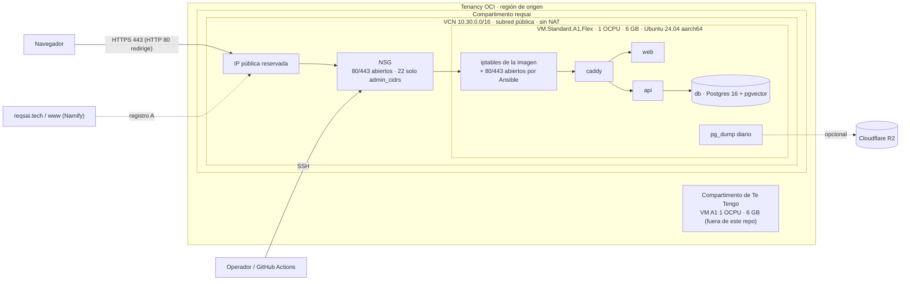

# Migración de producción de AWS a Oracle Cloud (OCI) Always Free

Esta guía mueve **todo ReqsAI** (Postgres con sus datos, API, frontend, Caddy con sus certificados y la
configuración) desde la EC2 `t4g.small` de AWS (`envs/ec2-compose`) a una VM Ampere A1 de **OCI Always Free**
(`envs/oci`). El cambio de DNS en Namify es el corte: hasta ese momento AWS sigue siendo producción y nada de
`envs/ec2-compose` cambia.

> **Resumen:** la prueba gratuita de `t4g.small` termina el **31-12-2026**; después la EC2 actual costaría
> ≈ US$ 17.5/mes + impuestos (sección 4). En OCI, una VM `VM.Standard.A1.Flex` de 1 OCPU / 6 GB entra en la
> capa Always Free junto con la VM de Te Tengo (1 OCPU / 6 GB). Corte estimado: **10–20 min sin API**
> (el frontend sigue cargando), con rollback inmediato mientras no cambie el DNS.

Todo lo que se ejecuta contra AWS, OCI, Namify o GitHub en esta guía lo ejecuta el equipo; los scripts de este
repo no se han ejecutado contra ningún host real (sección 10).

---

## Índice

1. [Qué usa ReqsAI hoy (What ReqsAI uses today)](#1-qué-usa-reqsai-hoy-what-reqsai-uses-today)
2. [Arquitectura destino en OCI](#2-arquitectura-destino-en-oci)
3. [Qué cambia en el repositorio](#3-qué-cambia-en-el-repositorio)
4. [Costos y límites](#4-costos-y-límites)
5. [Fase 0: preparar OCI sin tocar producción](#5-fase-0-preparar-oci-sin-tocar-producción)
6. [Fase 1: ventana de corte](#6-fase-1-ventana-de-corte)
7. [Rollback](#7-rollback)
8. [Despliegue continuo hacia OCI (GitHub Actions)](#8-despliegue-continuo-hacia-oci-github-actions)
9. [Desmantelar AWS (checklist para llegar a US$ 0)](#9-desmantelar-aws-checklist-para-llegar-a-us-0)
10. [Pruebas locales realizadas](#10-pruebas-locales-realizadas)
11. [Pendientes en los repos de la app](#11-pendientes-en-los-repos-de-la-app)
12. [No verificado](#12-no-verificado)
13. [Fuentes](#13-fuentes)

---

## 1. Qué usa ReqsAI hoy (What ReqsAI uses today)

Inventario hecho el **08-10-2026** con llamadas de solo lectura (`describe`/`list`/`get-cost-and-usage`, perfil
`reqsai-infra`, cuenta `418272789689`), lectura del estado local de Terraform (solo la lista de recursos), DNS
público y el código de `main` de `reqsai-api` y `reqsai-web`. No se leyó ningún valor secreto.

Destino: **Mueve** = pasa a OCI; **Reemplazo** = se sustituye por una alternativa gratuita; **Queda** = sigue donde
está; **Se elimina** = no hace falta fuera de AWS y se borra en el desmantelamiento (sección 9).

### 1.1 Recursos de AWS de ReqsAI

| Recurso | Estado verificado | Destino | Justificación |
| --- | --- | --- | --- |
| EC2 `i-0a4436759893052c8` (`reqsai-mvp`) | `t4g.small`, arm64, Ubuntu 24.04, `running`, creada el 07-10-2026 | **Mueve** a `VM.Standard.A1.Flex` 1 OCPU / 6 GB, Ubuntu 24.04 aarch64 | Misma arquitectura arm64: las imágenes que ya se construyen sirven sin cambios. |
| EBS `vol-057f1e53bc1e27961` | 20 GB gp3 cifrado, raíz de la EC2 | **Mueve** al boot volume de 50 GB | Guarda el SO, Docker, el volumen de Postgres, `caddy-data` y los dumps locales. Los datos pasan por `pg_dump`/`pg_restore` y copia de `caddy-data`, no se copia el disco. Sin snapshots. |
| Elastic IP `44.194.199.213` (`eipalloc-0a82e70cd04820351`) | Asociada a la EC2 | **Reemplazo**: IP pública reservada de OCI | Los registros `A` de Namify pasan a la IP nueva. |
| VPC `vpc-01489e72845cfdff9` 10.20.0.0/16, subred, IGW, tabla de rutas | Creadas por `envs/ec2-compose` | **Reemplazo**: VCN 10.30.0.0/16 con lo mismo | Equivalente 1:1, sin NAT. |
| Security group `reqsai-mvp-app` | 80/tcp, 443/tcp y 443/udp abiertos; 22/tcp desde dos `/32` de administración; salida libre | **Reemplazo**: NSG con las mismas reglas (`admin_cidrs`) | Igual que hoy. |
| Key pair `reqsai-mvp-admin` | Llave del usuario `ubuntu` | **Reemplazo**: metadata `ssh_authorized_keys` de la instancia | Ansible sigue agregando llaves con `base_authorized_keys`. |
| Rol IAM `reqsai-mvp-ec2` + instance profile | Solo `AmazonSSMManagedInstanceCore`; sin S3, ECR ni Secrets Manager | **Se elimina** | Nada en el host ni en la app usa credenciales de AWS. |
| SSM Session Manager | Agente `Online`; Ansible y el workflow entran con SSH sobre SSM | **Reemplazo**: SSH directo restringido a `admin_cidrs` (y opcionalmente OCI Bastion, gratuito) | Sección 8.2. El camino SSM sigue funcionando para AWS hasta el desmantelamiento. |
| Proveedor OIDC de GitHub + rol `reqsai-mvp-github-deploy` | Solo `ssm:StartSession` SSH hacia la EC2 | **Reemplazo**: llave SSH de despliegue + `known_hosts` en el environment `oci` | Sección 8. |
| Secrets Manager | **0 secretos** (el stack `envs/production` ya no existe) | **Queda** en Ansible Vault | Los secretos ya viven en `ansible/group_vars/reqsai/vault.yml` (laptop) y en los secretos del environment `mvp` de GitHub. |
| KMS | Solo las 4 llaves administradas por AWS (`aws/ebs`, `aws/secretsmanager`, `aws/rds`, `aws/acm`) | **Se elimina** con la cuenta/recursos | No hay llaves propias que migrar. |
| S3 | **0 buckets** | **Reemplazo** opcional: Cloudflare R2 para backups fuera del host y para el estado de Terraform | El bucket de estado `reqsai-terraform-state-418272789689` que nombra `envs/ec2-compose/providers.tf` **no existe**; el estado real es local (ver 1.3). `backup_s3_bucket` está vacío: hoy los dumps solo están en el host. |
| SES | Sin identidades, cuenta en sandbox | **Queda** sin uso | La app envía correo por SMTP (Gmail con App Password). |
| ECR | 0 repositorios | **Queda** sin uso | Las imágenes viajan como archivos `docker save` (workflow `deploy-mvp.yml`). |
| CloudFront, ALB, ECS, RDS, ACM, Lambda, CloudWatch Logs/alarmas, AWS Backup, DLM | No existen | Nada que hacer | El código de `envs/production` sigue en el repo pero no está desplegado. |
| Route 53 | 0 zonas hoy; la factura de octubre trae US$ 0.50 de *HostedZone* | Nada que hacer | Corresponde a una zona borrada este mes (el cargo es mensual). Confirmar que no reaparezca en noviembre. |
| Costo observado | 01–08 oct 2026: **US$ 0.74** con impuestos (Route 53 0.50, IPv4 pública 0.10, EBS 0.04, impuestos 0.12); horas de `t4g.small` a US$ 0 por la prueba gratuita | — | La IPv4 y el EBS ya se cobran hoy. |

### 1.2 Fuera de AWS

| Pieza | Estado verificado | Destino | Justificación |
| --- | --- | --- | --- |
| DNS `reqsai.tech` y `www.reqsai.tech` | Registrador Namify; nameservers `*.orderbox-dns.com`; ambos `A 44.194.199.213`, **TTL 7200** en el autoritativo | **Queda** en Namify; cambian los `A` | Bajar el TTL antes del corte (5.8). |
| TLS | Let's Encrypt emitido por Caddy, guardado en el volumen `reqsai_caddy-data` | **Mueve** (copia del volumen) | Con los certificados copiados la VM nueva sirve HTTPS para `reqsai.tech` desde el primer segundo, sin depender del reto ACME. |
| Volumen `reqsai_db-data` | Postgres 16 + pgvector 0.8.7 (`pgvector/pgvector:0.8.7-pg16`), esquemas por tenant | **Mueve** con `pg_dump -Fc` / `pg_restore` | Misma versión mayor en ambos lados. |
| Volumen `reqsai_caddy-config` | Configuración autoguardada de Caddy | No se copia | Caddy la regenera desde el `Caddyfile`. |
| `/var/backups/reqsai/*.dump` | Dumps diarios locales (7) | No se copian | El dump de migración los reemplaza; quedan en la EC2 detenida durante la ventana de rollback. |
| `/opt/reqsai/.env` y `api.env` | Renderizados por Ansible desde el vault | **Mueve** (Ansible los renderiza igual en OCI) | `migrate.sh config-diff` compara clave por clave sin mostrar valores. |
| Imágenes `reqsai-api:archive` / `reqsai-web:archive` | arm64, cargadas en el host | **Mueve** (`migrate.sh images`) o se recompilan con el workflow | Se copian las mismas imágenes que corren hoy. |
| Secretos de GitHub, environment `mvp` | `ANSIBLE_VAULT_PASSWORD`, `ANSIBLE_VAULT_B64`, `ANSIBLE_EXTRA_VARS_B64`, `DEPLOY_SSH_PRIVATE_KEY`; variables `APP_URL`, `AWS_DEPLOY_ROLE_ARN`, `AWS_REGION`, `EC2_INSTANCE_ID` | **Reemplazo**: environment `oci` | Sección 8. |
| APIs externas (Gemini, AssemblyAI, Deepgram, OpenAI, SMTP, Stripe, Jira) | HTTPS saliente | **Queda** | Solo necesitan salida a internet. |

### 1.3 Estado de Terraform y otros hallazgos

- `envs/ec2-compose` usa **estado local**: en la copia principal del repo hay un `backend_override.tf` (ignorado
  por git) con `backend "local" {}`, y el `terraform.tfstate` está solo en la laptop. Es lo único que permite
  hacer `terraform destroy` limpio al final: **haz una copia de ese archivo** (y de `terraform.tfvars`) antes de
  empezar y no lo borres hasta el paso 9.
- `bootstrap/` tiene un estado local vacío (sus recursos ya no existen).
- En la cuenta hay recursos que **no son de ReqsAI** y que esta guía no toca: el rol
  `waste-track-platform-ci-cd-service-role`, los security groups `Jenkins Server` y `Practice-Codely` de la VPC por
  defecto, el key pair `jhosepmyr-key-global` y el usuario IAM `terraform-reqsai` (el que usa Terraform).
- Código de la app: `reqsai-api` (`build.gradle.kts` de `main`) **no usa ningún SDK de AWS**; los avatares se
  guardan en Postgres (`bytea`) y los audios subidos no se escriben en disco. No hay cambios de código
  obligatorios (sección 11).

---

## 2. Arquitectura destino en OCI



| Recurso (`modules/oci-compose-host`) | Detalle |
| --- | --- |
| `oci_core_vcn` | 10.30.0.0/16, con DNS label |
| `oci_core_internet_gateway`, `oci_core_route_table` | Salida a internet `0.0.0.0/0` |
| `oci_core_default_security_list` | La lista por defecto de la VCN se vacía (por defecto abre el 22 a todo internet) |
| `oci_core_security_list` | Solo salida libre e ICMP para path MTU |
| `oci_core_subnet` | 10.30.0.0/24 pública |
| `oci_core_network_security_group` + reglas | 80/tcp, 443/tcp, 443/udp desde `0.0.0.0/0`; 22/tcp desde `admin_cidrs` y `deploy_ssh_cidrs` |
| `oci_core_instance` | A1.Flex, imagen más reciente `Canonical-Ubuntu-24.04-aarch64-*`, boot volume 50 GB conservado al destruir (`preserve_boot_volume`), solo endpoints IMDSv2, `RESTORE_INSTANCE` ante fallas, cloud-init mínimo (`python3`) |
| `oci_core_public_ip` | IP **reservada** asignada a la IP privada de la VNIC (`reserve_public_ip = false` usa una efímera) |

Firewall del host: las imágenes de Ubuntu de OCI traen reglas de iptables que **solo permiten SSH**. El rol `base`
(tareas `host_firewall.yml`) inserta `ACCEPT` para 80/tcp, 443/tcp y 443/udp antes del `REJECT` en vivo y en
`/etc/iptables/rules.v4`, sin tocar el resto (que protege el acceso iSCSI al boot volume). En EC2 ese archivo no
existe y las tareas se omiten. No uses `ufw` en estas imágenes, y no ejecutes `netfilter-persistent save` ni
`reload` con Docker corriendo (guardaría o borraría las cadenas de Docker); si ocurre,
`sudo systemctl restart docker`.

Te Tengo comparte la tenancy (y la asignación gratuita de A1) pero no este repo: usa su propio compartimento y
sus propios 1 OCPU / 6 GB. **La suma de todas las instancias A1 de la tenancy debe quedar en 2 OCPU / 12 GB.**

---

## 3. Qué cambia en el repositorio

| Archivo | Cambio |
| --- | --- |
| `modules/oci-compose-host/` | Módulo nuevo: red, NSG, instancia, IP reservada (proveedor `oracle/oci` `~> 9.9`, fijado en `.terraform.lock.hcl` a 9.9.0). |
| `envs/oci/` | Entorno nuevo: variables, outputs (IP, comandos, inventario de Ansible con `ansible_connection: ssh`), `terraform.tfvars.example`, `backend.hcl.example` (R2), pruebas `terraform test` con proveedor simulado. Estado local por defecto. |
| `ansible/group_vars/reqsai/memory.yml` | Perfil `medium` para 6 GB (Terraform lo elige con `memory_in_gbs >= 6`). |
| `ansible/roles/base/tasks/host_firewall.yml` | Abre 80/443 en el iptables de la imagen de OCI (se omite en EC2). |
| `ansible/roles/backup/` | Backups fuera del host a almacenamiento compatible con S3 sin rol de instancia: `backup_s3_endpoint_url`, `backup_s3_region` y llaves `vault_backup_s3_*`. Con los valores por defecto los scripts renderizados son idénticos a los actuales. |
| `ansible/inventory/oci.yml.example`, `vault.yml.example` | Ejemplo de inventario OCI y llaves nuevas del vault. |
| `Makefile` | `make inventory-oci` e `INVENTORY=` para `deploy`, `redeploy` y `backup-now`. |
| `.github/workflows/deploy-mvp.yml` | Entrada `target` (`auto`/`aws`/`oci`) y variable de repo `DEPLOY_TARGET`; `oci` despliega por SSH con `known_hosts` fijo en el environment `oci`. Sin la variable todo sigue yendo a AWS igual que hoy. |
| `scripts/oci-migration/migrate.sh` | Pasos de la migración (preflight, config-diff, images, caddy-data, freeze, dump, transfer, restore, verify, start, smoke, unfreeze). |
| `scripts/oci-migration/host-env-to-vault.sh` | Reconstruye un vault cifrado desde los `.env` de un host (solo si perdiste el vault). |
| `scripts/oci-migration/rehearse.sh` | Ensayo completo de `migrate.sh` con dos stacks de Docker locales y datos falsos. |

`envs/ec2-compose` y `envs/production` no cambian.

---

## 4. Costos y límites

### 4.1 AWS después de la prueba gratuita

La página de T4g ofrece `t4g.small` gratis hasta 750 h/mes **hasta el 31-12-2026**. Con los precios ya citados en
[deploy-ec2-docker-compose.md, sección 3](deploy-ec2-docker-compose.md#3-costos-por-qué-es-más-barato)
(us-east-1): `t4g.small` 0.0168 × 730 = 12.26 + EBS gp3 20 GB × 0.08 = 1.60 + IPv4 pública 0.005 × 730 = 3.65
→ **≈ US$ 17.51/mes antes de impuestos**. Hoy ya se pagan la IPv4 y el EBS (sección 1.1).

### 4.2 OCI Always Free (página oficial, consultada el 08-10-2026)

| Recurso | Límite Always Free | Uso de ReqsAI |
| --- | --- | --- |
| Ampere A1 (`VM.Standard.A1.Flex`) | 1,500 OCPU-hora y 9,000 GB-hora al mes, equivalentes a **2 OCPU y 12 GB** en total por tenancy | 1 OCPU / 6 GB (la otra mitad es de Te Tengo) |
| Block Volume (boot + block) | **200 GB** en total y 5 backups de volumen | 50 GB (+50 GB de Te Tengo) |
| Object Storage | 20 GB y 50,000 llamadas API/mes | No se usa por defecto |
| Transferencia de salida | 10 TB/mes | Holgado |
| Bastion | Gratis en cuentas free y pagadas | Opcional (8.2) |
| Región | Las instancias Always Free solo se crean en la **región de origen** | Elegir `sa-santiago-1` o `sa-saopaulo-1` al crear la cuenta: no se puede cambiar |

Discrepancia: la API pública del estimador de costos de Oracle (`B93297`/`B93298`, consultada el 08-10-2026) aún
muestra 3,000 OCPU-hora y 18,000 GB-hora gratis para A1. Manda la página de Always Free (la más restrictiva); el
plan de 1 + 1 OCPU entra en ambos casos.

**IP pública reservada:** la página de Always Free no la menciona y el estimador de costos (668 productos) no tiene
ningún SKU de IP pública; la documentación de red solo fija un límite de 50 reservadas por región. No se encontró
un precio oficial, así que queda **sin verificar** que sea gratis. Si en el primer mes aparece un cargo, aplica
`reserve_public_ip = false`: la IP efímera se conserva al detener la instancia pero se pierde al terminarla (y
hay que actualizar el DNS).

### 4.3 Recuperación de instancias ociosas y de cuentas

- Oracle considera **ociosa** una instancia Always Free si durante 7 días el percentil 95 de CPU, el uso de red y,
  en A1, el de memoria están **por debajo del 20 %**, y puede recuperarla. Con el perfil `medium` el heap de la
  JVM y `shared_buffers` deberían mantener la memoria por encima del 20 % de 6 GB, pero no está medido; vigila
  la métrica de memoria en la consola las primeras semanas.
- Pasar la cuenta a **Pay As You Go** evita esa recuperación según un correo de Oracle de 2023 reproducido por
  terceros (sección 13); la página oficial actual no lo dice. La FAQ oficial sí confirma que las cuentas pagadas
  siguen teniendo los recursos Always Free y que solo se cobra lo que exceda esa capa. Con PAYG cualquier recurso
  fuera de Always Free se cobra: revisa el costo antes de crear algo nuevo.
- La FAQ también avisa que una **cuenta** sin actividad 30 días o más puede considerarse abandonada, y que si al
  terminar la Free Trial la tenancy tiene más A1 de lo que permite Always Free, **todas** las instancias A1 se
  deshabilitan y se borran a los 30 días salvo que pases a cuenta pagada.

### 4.4 Alternativas gratuitas usadas

| Necesidad | Hoy en AWS | En OCI |
| --- | --- | --- |
| Estado de Terraform | Local (el bucket S3 no existe) | Local; opcional Cloudflare R2 (`backend.hcl.example`, 10 GB-mes gratis, salida gratis) |
| Backups fuera del host | Ninguno (`backup_s3_bucket` vacío) | Opcional: R2 con `backup_s3_endpoint_url` (proveedor distinto al del host, útil si se pierde la tenancy) u Object Storage de OCI (20 GB gratis, compatible con S3) |
| Acceso de administración | SSM Session Manager | SSH con `admin_cidrs`; OCI Bastion si se quiere cerrar el 22 |
| Secretos | Ansible Vault (Secrets Manager vacío) | Ansible Vault, sin cambios |
| Correo | SMTP de Gmail (SES sin uso) | Igual |

---

## 5. Fase 0: preparar OCI sin tocar producción

Todo esto se puede hacer días antes; AWS sigue atendiendo.

### 5.1 Prerrequisitos

- Cuenta OCI con la región de origen elegida; compartimento `reqsai` (Identity → Compartments).
- Llave de firma de API en `~/.oci/config` (perfil `DEFAULT` u otro → `oci_config_profile`), según
  *Required Keys and OCIDs* de la documentación de OCI.
- Copia de seguridad, fuera del repo, de: `envs/ec2-compose/terraform.tfstate` y `terraform.tfvars` (copia
  principal), `ansible/group_vars/reqsai/vault.yml`, `.vault-pass` y `ansible/mvp.local.yml`.
- Alias SSH en `~/.ssh/config` (los usan los scripts):

  ```
  Host reqsai-aws
    HostName 44.194.199.213
    User ubuntu
    IdentityFile ~/.ssh/<llave-admin-actual>
    # Si tu IP no está en admin_cidrs, por SSM:
    # HostName i-0a4436759893052c8
    # ProxyCommand aws ssm start-session --region us-east-1 --target %h --document-name AWS-StartSSHSession --parameters portNumber=%p

  Host reqsai-oci
    HostName <public_ip de envs/oci>
    User ubuntu
    IdentityFile ~/.ssh/<llave-admin>
  ```

### 5.2 Crear la infraestructura

```bash
cd envs/oci
cp terraform.tfvars.example terraform.tfvars
$EDITOR terraform.tfvars        # region, tenancy_ocid, compartment_ocid, admin_cidrs, ssh_public_key_path
terraform init
terraform plan
terraform apply
cd ../..
make inventory-oci              # escribe ansible/inventory/oci.yml (ignorado por git)
```

Deja `app_hostname = ""`: hasta el corte la VM se sirve en `<ip-con-guiones>.sslip.io`. Si `apply` responde
*Out of host capacity*, prueba otro `availability_domain` o reintenta más tarde (es falta temporal de capacidad
A1 en la región).

### 5.3 Overrides de Ansible para OCI

```bash
cp ansible/mvp.local.yml ansible/oci.local.yml   # ignorado por git (ansible/*.local.yml)
$EDITOR ansible/oci.local.yml
```

En `oci.local.yml`, antes del corte:

- **Quita** `app_hostname` y deja `app_redirect_hostnames: []` (el inventario ya trae el nombre sslip.io; si
  pasaras `reqsai.tech` ahora, Caddy intentaría emitir un certificado mientras el DNS apunta a AWS).
- En `base_authorized_keys`, la llave de despliegue de GitHub **sin** `from="127.0.0.1,::1"` (esa restricción
  solo tiene sentido con el túnel SSM); conserva `no-agent-forwarding,no-port-forwarding,no-X11-forwarding`.
  Mejor aún, genera una llave nueva solo para OCI (8.1).
- `app_images_archive_dir` puede quedarse: los comandos de esta guía lo sobrescriben con `-e`, y el secreto de
  GitHub se sube sin esa línea.

### 5.4 Configurar el host

```bash
cd ansible
ansible-playbook site.yml -i inventory/oci.yml -e @oci.local.yml --ask-vault-pass --tags base,docker
cd ..
OLD_HOST=reqsai-aws NEW_HOST=reqsai-oci scripts/oci-migration/migrate.sh images   # las mismas imágenes que corren hoy
mkdir -p dist/empty
cd ansible
ansible-playbook site.yml -i inventory/oci.yml -e @oci.local.yml --ask-vault-pass -e app_images_archive_dir=$PWD/../dist/empty
cd ..
```

Con `app_images_archive_dir` apuntando a un directorio vacío, Ansible no sube nada y usa las imágenes
`reqsai-*:archive` ya cargadas. El primer arranque hace las migraciones Flyway sobre una base vacía (que el
restore reemplazará). Comprueba `https://<ip-con-guiones>.sslip.io/actuator/health` → `UP`.

### 5.5 Comprobaciones

```bash
export OLD_HOST=reqsai-aws NEW_HOST=reqsai-oci
scripts/oci-migration/migrate.sh preflight     # versiones de Postgres/pgvector, tamaño de la base, disco, imágenes
scripts/oci-migration/migrate.sh config-diff   # .env y api.env clave por clave
```

En `config-diff` lo esperado como `DIFFERENT` son solo las claves del perfil de memoria (`API_JAVA_OPTS`,
`API_MEM_LIMIT`, `DB_MEM_LIMIT`, `POSTGRES_*` de tuning, `DB_POOL_SIZE`) y, antes del corte, las que dependen
del hostname (`APP_HOSTNAME`, `APP_URL`, `FRONTEND_URL`, `WEB_APP_URL`, `CORS_ALLOWED_ORIGINS`). Los secretos
(`POSTGRES_PASSWORD`, `DB_PASSWORD`, llaves JWT, `INTEGRATIONS_ENCRYPTION_KEY`, API keys) deben salir `same`: con
llaves distintas los secretos de integraciones cifrados en la base no se podrían descifrar. El script compara HMAC
con una sal aleatoria por ejecución; nunca imprime ni guarda valores.

Si perdiste el vault local, reconstrúyelo desde el host en ejecución (nada sale en claro por la terminal ni toca el
disco sin cifrar):

```bash
OLD_HOST=reqsai-aws scripts/oci-migration/host-env-to-vault.sh   # escribe dist/migration/vault.from-host.yml cifrado
```

### 5.6 Ensayo general con datos reales (recomendado)

Mide los tiempos reales sin cortar el servicio. `ALLOW_LIVE_DUMP=1` permite el dump con la API de AWS
encendida (dump consistente de Postgres, pero sin congelar escrituras: es solo un ensayo).

```bash
export OLD_HOST=reqsai-aws NEW_HOST=reqsai-oci CHECKSUMS=1
time ALLOW_LIVE_DUMP=1 scripts/oci-migration/migrate.sh dump
time scripts/oci-migration/migrate.sh transfer
time scripts/oci-migration/migrate.sh restore
scripts/oci-migration/migrate.sh verify        # puede diferir si hubo escrituras durante el dump
time scripts/oci-migration/migrate.sh start
```

Revisa la app en la URL sslip.io con una cuenta de prueba. Mientras esta copia esté encendida no la uses con
cuentas reales: esos cambios se pierden en el restore del corte. Los únicos procesos programados de la API son la
purga diaria de tokens (local a su base), así que la copia no envía correos por sí sola.

### 5.7 Copiar los certificados

```bash
scripts/oci-migration/migrate.sh caddy-data
```

Copia `/data` de Caddy (cuenta ACME y certificados de `reqsai.tech`/`www`) sin los locks. Se puede repetir.

### 5.8 Bajar el TTL del DNS

En Namify (DNS Management de `reqsai.tech`), cambia el TTL de los `A` de `reqsai.tech` y `www` de **7200 a 300**
al menos **2 horas** antes del corte (mejor 24 h). Compruébalo en el autoritativo:

```bash
dig +noall +answer @cont603385.venus.orderbox-dns.com reqsai.tech A
dig +noall +answer @cont603385.venus.orderbox-dns.com www.reqsai.tech A
```

Si el panel no acepta 300, usa el mínimo que permita y ajusta las esperas de la fase 1.

### 5.9 Preparar GitHub

Sigue la sección 8 hasta tener el environment `oci` y un despliegue `keep`/`keep` con `target=oci` en verde.

---

## 6. Fase 1: ventana de corte

Duración estimada **10–20 min sin API** (no medida: usa los tiempos del ensayo 5.6). Componentes: dump +
transferencia (dependen del tamaño que muestra `preflight` y del ancho de banda de tu conexión, porque el dump
pasa por tu máquina vía SSH), restore (~1 min para una base pequeña), arranque de Spring Boot en A1 (1–3 min,
no medido) y propagación de DNS (≤ 5 min con TTL 300 en resolvers que respetan el TTL). Durante el corte el
frontend carga, pero toda llamada a `/api` falla.

```bash
export OLD_HOST=reqsai-aws NEW_HOST=reqsai-oci CHECKSUMS=1
export NEW_IP=$(terraform -chdir=envs/oci output -raw public_ip) APP_HOSTNAME=reqsai.tech
R=Kntro-Soft/reqsai-infra
```

| # | Paso | Comando | Corte |
| --- | --- | --- | --- |
| 1 | Pausar los despliegues a AWS | `gh workflow disable deploy-mvp.yml -R $R` | no |
| 2 | Certificados al día | `scripts/oci-migration/migrate.sh caddy-data` | no |
| 3 | Pasar la VM nueva al hostname de producción: en `ansible/oci.local.yml` pon `app_hostname: reqsai.tech` y `app_redirect_hostnames: [www.reqsai.tech]`; luego `cd ansible && ansible-playbook site.yml -i inventory/oci.yml -e @oci.local.yml --ask-vault-pass --tags app -e app_images_archive_dir=$PWD/../dist/empty -e app_verify_https=false && cd ..` (el chequeo HTTPS se omite porque el DNS aún apunta a AWS) | no |
| 4 | Revisión final | `scripts/oci-migration/migrate.sh preflight && scripts/oci-migration/migrate.sh config-diff` (solo deben diferir las claves de memoria) | no |
| 5 | **Congelar** AWS (inicio del corte) | `scripts/oci-migration/migrate.sh freeze` | **sí** |
| 6 | Dump, copia y checksum | `scripts/oci-migration/migrate.sh dump && scripts/oci-migration/migrate.sh transfer` | sí |
| 7 | Restaurar y verificar filas (y MD5 por tabla) | `scripts/oci-migration/migrate.sh restore && scripts/oci-migration/migrate.sh verify` | sí |
| 8 | Arrancar y probar por IP | `scripts/oci-migration/migrate.sh start && scripts/oci-migration/migrate.sh smoke` (health `UP`, `microphone=(self)`, certificado válido para `reqsai.tech` servido desde la IP nueva) | sí |
| 9 | **DNS**: en Namify, `A reqsai.tech` y `A www` → `$NEW_IP` | `dig +short @cont603385.venus.orderbox-dns.com reqsai.tech` hasta ver la IP nueva; luego `dig +short reqsai.tech @1.1.1.1` y `@8.8.8.8` | sí, hasta propagar |
| 10 | Comprobar desde fuera | `curl -s https://reqsai.tech/actuator/health`, login real, una sesión con micrófono | fin del corte |
| 11 | Despliegues hacia OCI | sección 8.4 (variable `DEPLOY_TARGET=oci`) y `gh workflow enable deploy-mvp.yml -R $R` | no |
| 12 | Backup inmediato en OCI | `make backup-now INVENTORY=inventory/oci.yml` | no |

La API de AWS queda **detenida** a propósito: un cliente con DNS viejo ve errores en vez de escribir en la base
abandonada. No arranques AWS de nuevo salvo para un rollback.

Si `verify` o `smoke` fallan en los pasos 7–8: **no cambies el DNS**; ejecuta `migrate.sh unfreeze` (sección 7) e
investiga con calma.

---

## 7. Rollback

| Momento | Qué hacer | Pérdida de datos |
| --- | --- | --- |
| Antes del paso 9 (DNS sin cambiar) | `scripts/oci-migration/migrate.sh unfreeze` y `gh workflow enable deploy-mvp.yml -R $R` | Ninguna: AWS no recibió escrituras nuevas |
| Después del paso 9, sin escrituras relevantes en OCI | Devolver los `A` a `44.194.199.213`, `unfreeze`, reactivar despliegues con `DEPLOY_TARGET=aws` | Lo escrito en OCI desde el corte |
| Después del paso 9, conservando lo escrito en OCI | Migración inversa con los mismos comandos y los roles cambiados: `OLD_HOST=reqsai-oci NEW_HOST=reqsai-aws migrate.sh freeze`, `dump`, `transfer`, `restore`, `verify`, `start`; luego DNS de vuelta a AWS | Ninguna |

**Ventana de rollback: 14 días.** Durante ese tiempo la EC2 queda **detenida, no terminada** (el usuario ejecuta
`aws ec2 stop-instances --region us-east-1 --instance-ids i-0a4436759893052c8` una vez estable OCI, por ejemplo
al día siguiente). Detenida no cobra horas de instancia, pero sí el EBS (20 GB × 0.08 = US$ 1.60/mes) y la IPv4
pública (0.005 × 730 = US$ 3.65/mes), prorrateados. El EBS conserva la base de AWS y el dump de migración en
`/var/backups/reqsai/migration/`. Para volver: `aws ec2 start-instances ...`, esperar el health, y seguir la tabla.

---

## 8. Despliegue continuo hacia OCI (GitHub Actions)

`deploy-mvp.yml` sigue siendo el único workflow: los repos de la app lo disparan igual que hoy. Se agregó:

- la entrada `target` (`auto` por defecto, `aws`, `oci`) en *Run workflow*;
- la variable de repositorio `DEPLOY_TARGET` que usan `auto`, `push` y `repository_dispatch` (sin definir → `aws`);
- con `oci`, el job `deploy` corre en el environment **`oci`**, no asume ningún rol de AWS ni instala el plugin de
  SSM, y entra por SSH directo a `SSH_HOST` aceptando **solo** la llave de host guardada en `SSH_KNOWN_HOSTS`
  (`StrictHostKeyChecking=yes`).

### 8.1 Environment `oci`

| Nombre | Tipo | Contenido |
| --- | --- | --- |
| `ANSIBLE_VAULT_PASSWORD` | secreto | igual que en `mvp` |
| `ANSIBLE_VAULT_B64` | secreto | el mismo `vault.yml` cifrado, en base64 |
| `ANSIBLE_EXTRA_VARS_B64` | secreto | `ansible/oci.local.yml` sin `app_images_archive_dir`, en base64 |
| `DEPLOY_SSH_PRIVATE_KEY` | secreto | llave privada de despliegue para OCI (nueva, ed25519) |
| `SSH_KNOWN_HOSTS` | secreto | línea `known_hosts` de la VM (ver abajo) |
| `SSH_HOST` | variable | IP pública de `envs/oci` |
| `APP_URL` | variable | `https://<ip-con-guiones>.sslip.io` antes del corte; `https://reqsai.tech` después |
| `MEMORY_PROFILE` | variable (opcional) | por defecto `medium` |

```bash
R=Kntro-Soft/reqsai-infra
ssh-keygen -t ed25519 -N '' -C reqsai-oci-github-deploy -f /tmp/reqsai-oci-deploy/id_ed25519
# agrega la pública a base_authorized_keys en oci.local.yml con el prefijo
#   no-agent-forwarding,no-port-forwarding,no-X11-forwarding
# y autorízala: cd ansible && ansible-playbook site.yml -i inventory/oci.yml -e @oci.local.yml --tags authorized_keys --ask-vault-pass

IP=$(terraform -chdir=envs/oci output -raw public_ip)
ssh reqsai-oci 'ssh-keygen -lf /etc/ssh/ssh_host_ed25519_key.pub'   # huella vista desde dentro
ssh-keyscan -t ed25519 "$IP" > /tmp/reqsai-oci-deploy/known_hosts
ssh-keygen -lf /tmp/reqsai-oci-deploy/known_hosts                    # debe coincidir con la anterior

gh api -X PUT repos/$R/environments/oci
gh secret set ANSIBLE_VAULT_PASSWORD --env oci -R $R < .vault-pass
base64 < ansible/group_vars/reqsai/vault.yml | tr -d '\n' | gh secret set ANSIBLE_VAULT_B64 --env oci -R $R
grep -v '^app_images_archive_dir:' ansible/oci.local.yml | base64 | tr -d '\n' | gh secret set ANSIBLE_EXTRA_VARS_B64 --env oci -R $R
gh secret set DEPLOY_SSH_PRIVATE_KEY --env oci -R $R < /tmp/reqsai-oci-deploy/id_ed25519
gh secret set SSH_KNOWN_HOSTS --env oci -R $R < /tmp/reqsai-oci-deploy/known_hosts
gh variable set SSH_HOST --env oci -R $R --body "$IP"
gh variable set APP_URL --env oci -R $R --body "https://$(terraform -chdir=envs/oci output -raw app_hostname)"
rm -rf /tmp/reqsai-oci-deploy
```

Restringe el environment a la rama `main` (*Settings → Environments → oci → Deployment branches*), como `mvp`.

### 8.2 Red: cómo llega el runner al puerto 22

Los runners de GitHub no tienen IP fija, y el NSG solo abre el 22 a `admin_cidrs`. Opciones:

| Opción | Cómo | Contras |
| --- | --- | --- |
| **A. Desplegar desde la laptop** (por defecto) | `make images-archive` y luego `make redeploy INVENTORY=inventory/oci.yml VAULT_ARGS="--ask-vault-pass -e @oci.local.yml -e app_images_archive_dir=$PWD/dist/images"` (como en la sección 7.4 de la guía de EC2) | Sin despliegue automático desde los repos de la app |
| B. Abrir el 22 al mundo solo con llave | `deploy_ssh_cidrs = ["0.0.0.0/0"]` en `envs/oci/terraform.tfvars` | Expone sshd a internet (la imagen de Ubuntu de OCI ya trae login de root deshabilitado y solo acceso por llave); ruido de escaneos |
| C. OCI Bastion (gratis) | Sesión de port forwarding creada por el workflow con la CLI de OCI y una llave de API en GitHub | No implementado; requiere una política IAM de OCI para sesiones de Bastion |

Con B o C, prueba antes del corte: *Actions → Deploy MVP → Run workflow* con `target=oci`, `api_ref=keep`,
`web_ref=keep`.

### 8.3 Antes del corte

Con `DEPLOY_TARGET` sin definir, los `push` de las apps siguen desplegando a AWS. Mientras OCI no sea producción
solo se despliega allí a mano con `target=oci`.

### 8.4 Después del corte

```bash
R=Kntro-Soft/reqsai-infra
grep -v '^app_images_archive_dir:' ansible/oci.local.yml | base64 | tr -d '\n' | gh secret set ANSIBLE_EXTRA_VARS_B64 --env oci -R $R
gh variable set APP_URL --env oci -R $R --body https://reqsai.tech
gh variable set DEPLOY_TARGET -R $R --body oci
gh workflow enable deploy-mvp.yml -R $R
gh workflow run deploy-mvp.yml -R $R -f api_ref=keep -f web_ref=keep
```

Desde ese momento los `push` a `main` de reqsai-api y reqsai-web despliegan en OCI sin tocar esos repos. Un
seguimiento posterior puede borrar la rama AWS del workflow cuando AWS esté desmantelado.

---

## 9. Desmantelar AWS (checklist para llegar a US$ 0)

Lo ejecuta el equipo **después de la ventana de rollback** (14 días) y con OCI estable. Nada de esto se ejecutó.

- [ ] OCI lleva 14 días sin incidentes; `systemctl list-timers reqsai-backup.timer` en OCI muestra backups
      diarios y hay una copia reciente fuera del host (R2 o tu máquina).
- [ ] Descarga el último dump de AWS como archivo histórico (arranca la EC2 si hace falta y usa el `scp` de
      [deploy-ec2-docker-compose.md, sección 9](deploy-ec2-docker-compose.md#9-backups-y-restauración)).
- [ ] Desde la **copia principal** del repo (donde están el `backend_override.tf` local y el
      `terraform.tfstate` de `envs/ec2-compose`): pon `termination_protection = false` en
      `envs/ec2-compose/terraform.tfvars`, `terraform apply`, y luego `terraform destroy`. Elimina la instancia,
      el EBS (con la base de AWS), la Elastic IP, la VPC, subred, IGW, rutas, security group, key pair
      `reqsai-mvp-admin`, rol e instance profile `reqsai-mvp-ec2`, el rol `reqsai-mvp-github-deploy` y el
      proveedor OIDC `token.actions.githubusercontent.com` (lo creó este entorno).
- [ ] Verifica con lecturas: `aws ec2 describe-instances`, `describe-volumes`, `describe-addresses`,
      `describe-snapshots --owner-ids self`, `aws iam list-roles`, `aws iam list-open-id-connect-providers`,
      `aws route53 list-hosted-zones`, `aws s3api list-buckets`.
- [ ] GitHub: borra el environment `mvp` (o sus secretos y las variables `AWS_DEPLOY_ROLE_ARN`, `AWS_REGION`,
      `EC2_INSTANCE_ID`).
- [ ] Revisa lo que no es de ReqsAI (sección 1.3) y decide aparte: rol `waste-track-platform-ci-cd-service-role`,
      security groups `Jenkins Server` y `Practice-Codely`, key pair `jhosepmyr-key-global`, y el usuario IAM
      `terraform-reqsai` (desactiva o borra sus access keys si ya nada lo usa).
- [ ] En *Billing → Bills* del mes siguiente el total debe ser US$ 0 (sin `HostedZone`, IPv4 ni EBS). Si aparece
      algo, Cost Explorer agrupado por *Usage type* muestra qué es.
- [ ] Borra el `terraform.tfstate` local de `envs/ec2-compose` solo cuando el `destroy` haya terminado y la
      verificación salga vacía; borra también `dist/migration/` (contiene los conteos y, si usaste
      `KEEP_LOCAL_COPY=1`, un dump con datos personales).
- [ ] Opcional: cerrar la cuenta de AWS si no se usará para nada más.

---

## 10. Pruebas locales realizadas

Sin cuenta de OCI y sin tocar producción (08-10-2026):

| Prueba | Resultado |
| --- | --- |
| `terraform fmt -check`, `terraform init -backend=false`, `terraform validate` en `envs/oci` (Terraform 1.16.3, `oracle/oci` 9.9.0) | OK |
| `terraform test` (`envs/oci/tests/plan.tftest.hcl`, proveedor OCI simulado): IP reservada vs efímera, fallback a sslip.io, selección del perfil de memoria, inventario, validación del boot volume | 3/3 |
| `tflint` v0.64.0 en `envs/oci` y en el módulo (con reglas de documentación, nombres y declaraciones sin uso) | sin hallazgos |
| `ansible-lint` | solo el hallazgo previo de `main` (`no-handler` en `roles/app/tasks/archive.yml`) |
| `actionlint` del workflow; los scripts de `refs` y de credenciales extraídos del YAML y ejecutados con `bash` para `aws` y `oci` | OK; el inventario de AWS sale idéntico al de `main` |
| `host_firewall.yml` contra un contenedor Ubuntu 24.04 con un `rules.v4` como el de OCI (dos corridas) y contra otro sin ese archivo | abre 80/443 antes del `REJECT`, idempotente, `iptables-restore --test` OK; se omite sin el archivo |
| Plantillas de backup renderizadas sin bucket, con S3 de AWS y con R2; `shellcheck` | los dos primeros modos son idénticos byte a byte a `main` |
| `scripts/oci-migration/rehearse.sh`: dos stacks con `pgvector/pgvector:0.8.7-pg16` y datos falsos (2 tenants, `vector(3)` con índice HNSW, `bytea`, `jsonb`; 40,540 filas) a través de stubs de `ssh`/`sudo` | 15/15: preflight, config-diff sin filtrar valores, images, caddy-data sin locks, dump rechazado sin freeze, checksum, restore, verify (conteos + MD5), detección de una fila borrada y de un valor cambiado, restore rechaza un dump corrupto, consulta vectorial, start, unfreeze, permisos `0600` |
| `host-env-to-vault.sh` con `.env` falsos y llaves RSA generadas | vault cifrado; la llave privada reconstruida es idéntica |
| `shellcheck` de todos los scripts | OK |

Repetir el ensayo: `scripts/oci-migration/rehearse.sh` (necesita Docker; `KEEP=1` conserva el directorio).

---

## 11. Pendientes en los repos de la app

No hay cambios de código obligatorios: ninguna app usa SDKs ni servicios de AWS. Solo documentación desactualizada
(no se modificó nada en esos repos):

| Repo | Archivo | Qué |
| --- | --- | --- |
| reqsai-api | `ecs/task-definition.json` | Definición de tarea de ECS con el endpoint de RDS del stack ya destruido; borrar o marcar como histórica |
| reqsai-api | `docs/DEPLOYMENT.md`, `docs/adr/0006-deploy-on-aws-ecs-fargate.md` | Describen ECS/ECR/RDS/Secrets Manager y un `deploy.yml` que ya no hace eso; apuntar a `reqsai-infra` y registrar en un ADR nuevo el paso a OCI |
| reqsai-web | `src/environments/environment.prod.ts` | El comentario dice que CloudFront hace de proxy; hoy es Caddy (la configuración vacía sigue siendo correcta) |
| reqsai-web | `docs/DEPLOYMENT.md`, `docs/adr/0009-deploy-s3-cloudfront.md` | Igual que en la API |

---

## 12. No verificado

- Que la **IP pública reservada** sea gratuita (sección 4.2).
- La exención de recuperación por inactividad al pasar a **Pay As You Go** (solo fuente de terceros, 2023).
- Que la memoria del perfil `medium` supere el 20 % que usa Oracle para considerar ociosa una A1.
- Tiempo de arranque de la API y tamaño real del dump: no se midieron (no se accedió a la base de producción);
  `preflight` y el ensayo 5.6 los dan.
- El TTL mínimo que acepta el panel DNS de Namify.
- `use_lockfile` contra R2: R2 documenta `If-None-Match` en `PutObject`, pero HashiCorp solo garantiza el backend
  S3 contra AWS; prueba dos `plan` simultáneos antes de confiar en el bloqueo.
- Nada de `envs/oci` se aplicó ni se probó contra la API real de OCI (solo `validate`, `tflint` y pruebas con
  proveedor simulado): el primer `terraform plan` con cuenta real es la verificación pendiente.

---

## 13. Fuentes

Consultadas el 08-10-2026.

- [Amazon EC2 T4g: prueba gratuita de `t4g.small` hasta el 31-12-2026](https://aws.amazon.com/ec2/instance-types/t4/)
- [Always Free Resources (OCI): A1 2 OCPU / 12 GB, 200 GB de bloques, 20 GB de Object Storage, 10 TB de salida, región de origen, Bastion gratis, política de instancias ociosas](https://docs.oracle.com/en-us/iaas/Content/FreeTier/resourceref.htm)
- [Oracle Cloud Free Tier FAQ: cuentas inactivas 30 días, A1 por encima del límite al terminar la Free Trial, Always Free en cuentas pagadas](https://www.oracle.com/cloud/free/faq/)
- [API del estimador de costos de Oracle (`B93297`, `B93298`, sin SKU de IP pública)](https://apexapps.oracle.com/pls/apex/cetools/api/v1/products/?currencyCode=USD)
- [Public IP Addresses (OCI): efímeras vs reservadas, límite de 50 reservadas por región](https://docs.oracle.com/en-us/iaas/Content/Network/Tasks/managingpublicIPs.htm)
- [Platform Images (OCI): reglas de firewall por defecto (solo SSH), no usar UFW, usuario `ubuntu`, login de root deshabilitado](https://docs.oracle.com/en-us/iaas/Content/Compute/References/images.htm)
- [Tercero, 2023: correo de Oracle sobre la recuperación de instancias ociosas y Pay As You Go](https://blog.51sec.org/2023/02/oracle-cloud-cleaning-up-idle-compute.html)
- [Terraform S3 backend (argumentos para almacenamiento compatible con S3, `use_lockfile`)](https://developer.hashicorp.com/terraform/language/backend/s3)
- [Cloudflare: Remote R2 backend para Terraform](https://developers.cloudflare.com/terraform/advanced-topics/remote-backend/)
- [Cloudflare R2: compatibilidad con la API de S3 (`PutObject` con `If-None-Match`)](https://developers.cloudflare.com/r2/api/s3/api/)
- [Cloudflare R2: precios y capa gratuita (10 GB-mes, salida gratis)](https://developers.cloudflare.com/r2/pricing/)
- [Registro del proveedor `oracle/oci` (9.9.0)](https://registry.terraform.io/providers/oracle/oci/latest)
- Precios de AWS usados en 4.1: los de [deploy-ec2-docker-compose.md, sección 15](deploy-ec2-docker-compose.md#15-fuentes).
